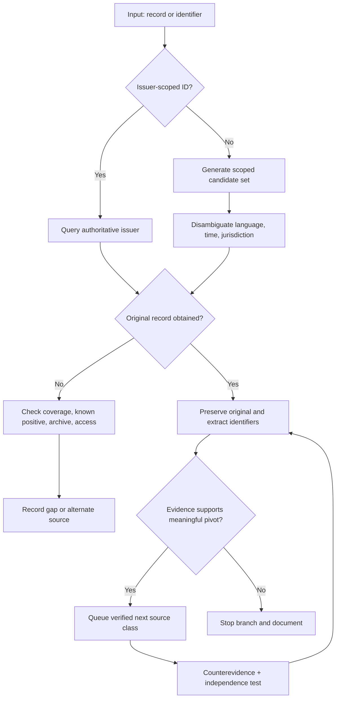
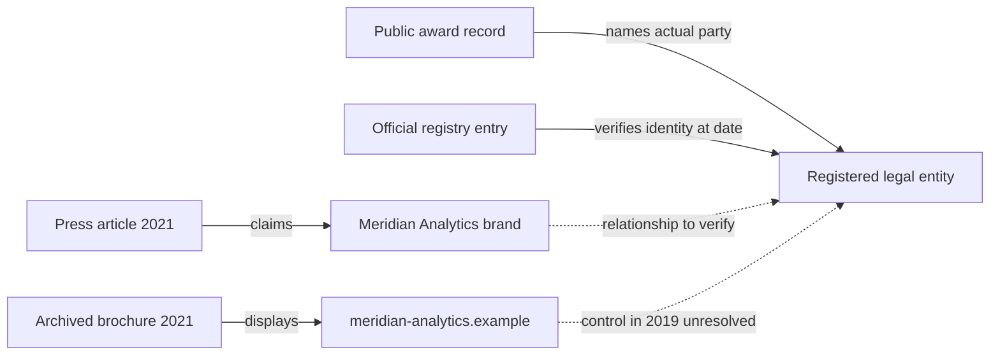

# OSINT Source Discovery & Pivot Engineering - The Investigative Collection Fieldbook

Methods for finding original sources, testing identifiers and relationships, preserving evidence and reporting supported findings.

**Author:** Marcin Meller ([osintshifu](https://github.com/osintshifu))

| Publication | Details |
|:--|:--|
| Published in | [OSINT Tradecraft](https://github.com/osintshifu/osint-tradecraft) |
| Edition | First edition, October 2026 |
| Revision date | 9 October 2026 |
| Language | English |
| Canonical source | [OSINT Source Discovery & Pivot Engineering - The Investigative Collection Fieldbook](https://github.com/osintshifu/osint-tradecraft/blob/main/field-guides/osint-source-discovery-pivot-engineering-fieldbook.md) |
| Rights | Copyright (c) 2026 Marcin Meller (osintshifu). No reuse license is specified in the source repository. |

**Suggested citation**

> Meller, Marcin (osintshifu). 2026. *OSINT Source Discovery & Pivot Engineering - The Investigative Collection Fieldbook.* OSINT Tradecraft. Revised 9 October 2026. https://github.com/osintshifu/osint-tradecraft/blob/main/field-guides/osint-source-discovery-pivot-engineering-fieldbook.md

## How to use this fieldbook

For a new case, define the intelligence requirement and map the record custodians before selecting tools. For work already in progress, choose a task below or open the full contents. Keep this fieldbook's revision date with the methods recorded for the case.

| Task | Start with |
|:--|:--|
| Define a question and collection plan | [Requirements](#02-define-intelligence-requirements-and-testable-questions) and [source mapping](#03-map-record-custodians-and-source-coverage) |
| Choose a source from an identifier | [Pivots](#05-select-identifiers-and-decide-when-to-pivot), [source atlas](#11-source-atlas) and [investigation cards](#28-quick-reference-investigation-cards) |
| Practise a complete procedure | [Twelve laboratories](#13-laboratory-1-map-sources-for-a-defined-mandate) and the [worked case](#42-worked-case-resolve-a-supplier-and-domain-relationship) |
| Preserve files and record searches | [Evidence pipeline](#25-a-reproducible-local-evidence-pipeline), [dependency audit](#26-a-deterministic-dependency-audit-synthetic-data) and [investigation records](#27-maintain-investigation-records) |
| Use an API or check missing results | [Retrieval recipes](#31-structured-retrieval-recipes), [coverage matrix](#33-assess-coverage-by-dimension) and [negative results](#50-negative-results-sampling-bias-and-saturation) |
| Review or hand over findings | [Investigation checklist](#43-investigation-checklist), [templates](#45-deliverables-and-templates) and [quality-control exercises](#51-investigation-quality-control-exercises) |

The procedures, code examples and templates are contained in this file. Network services require access and may impose account, rate or budget limits. Local examples state their runtime requirements. Mermaid diagrams have text explanations; a reader without Mermaid support can follow the same procedure from the surrounding text. For detailed examination of media, use the companion [Digital Media Authenticity, Provenance & Forensics guide](./digital-media-authenticity-provenance-field-guide.md).

### Terms used in this fieldbook

| Term | Meaning here |
|:--|:--|
| PIR / SIR | Priority intelligence requirement / specific intelligence requirement: the decision question and its narrower collection questions |
| Custodian | Institution or operator responsible for producing or maintaining a record collection |
| Pivot | A justified move from an observed identifier to another relevant record or source |
| Mention / entity / edge | A source's reference to something / the resolved subject / a claimed directed relationship |
| Valid time / recorded time | When a relationship applies / when an investigator or system recorded it; retain both when correcting history |
| Root origin / DAG | A documented terminal origin in a dependency model / a directed acyclic graph used to trace derivations |
| Fixture / control | Prepared input with an expected result / a check used to detect a failing or misleading method |
| Coverage / saturation | The source, time, language and identifier boundaries checked / declining verified information gain within those boundaries |
| RDAP / RIR / ASN / CT | Registration Data Access Protocol / Regional Internet Registry / autonomous system number / Certificate Transparency |
| WARC / WACZ / CDX | Web archive records / a packaged web archive and indexes / a capture index; none establishes the truth of archived claims |
| OCR / ASR / SBOM | Optical character recognition / automatic speech recognition / software bill of materials |
| OAI-PMH / SPARQL / MCP | Metadata-harvesting protocol / RDF query language / Model Context Protocol for connecting applications to tools and resources |

---

<details>
<summary>Full contents</summary>

- [01. Plan the investigation around a claim](#01-plan-the-investigation-around-a-claim)
- [02. Define intelligence requirements and testable questions](#02-define-intelligence-requirements-and-testable-questions)
- [03. Map record custodians and source coverage](#03-map-record-custodians-and-source-coverage)
- [04. Query design: ten search approaches](#04-query-design-ten-search-approaches)
- [05. Select identifiers and decide when to pivot](#05-select-identifiers-and-decide-when-to-pivot)
- [06. Entity resolution and merge decisions](#06-entity-resolution-and-merge-decisions)
- [07. Separate six types of time](#07-separate-six-types-of-time)
- [08. Provenance, corroboration and alternatives](#08-provenance-corroboration-and-alternatives)
- [09. Manage recursive research and stopping criteria](#09-manage-recursive-research-and-stopping-criteria)
- [10. Preservation and operational safety](#10-preservation-and-operational-safety)
- [11. Source atlas](#11-source-atlas)
- [12. Evaluate tools and their implementations](#12-evaluate-tools-and-their-implementations)
- [13. Laboratory 1: map sources for a defined mandate](#13-laboratory-1-map-sources-for-a-defined-mandate)
- [14. Laboratory 2: trace a footnote to its dataset](#14-laboratory-2-trace-a-footnote-to-its-dataset)
- [15. Laboratory 3: recover a missing page](#15-laboratory-3-recover-a-missing-page)
- [16. Laboratory 4: reconstruct publication and software history](#16-laboratory-4-reconstruct-publication-and-software-history)
- [17. Laboratory 5: test an infrastructure relationship](#17-laboratory-5-test-an-infrastructure-relationship)
- [18. Laboratory 6: review entity reconciliation](#18-laboratory-6-review-entity-reconciliation)
- [19. Laboratory 7: reconstruct a procurement relationship](#19-laboratory-7-reconstruct-a-procurement-relationship)
- [20. Laboratory 8: audit source independence](#20-laboratory-8-audit-source-independence)
- [21. Laboratory 9: verify names across languages and time](#21-laboratory-9-verify-names-across-languages-and-time)
- [22. Laboratory 10: resolve conflicting accounts and corrections](#22-laboratory-10-resolve-conflicting-accounts-and-corrections)
- [23. Laboratory 11: interpret a search with no matches](#23-laboratory-11-interpret-a-search-with-no-matches)
- [24. Laboratory 12: verify agent-assisted collection](#24-laboratory-12-verify-agent-assisted-collection)
- [25. A reproducible local evidence pipeline](#25-a-reproducible-local-evidence-pipeline)
- [26. A deterministic dependency audit (synthetic data)](#26-a-deterministic-dependency-audit-synthetic-data)
- [27. Maintain investigation records](#27-maintain-investigation-records)
- [28. Quick-reference investigation cards](#28-quick-reference-investigation-cards)
- [29. Collection techniques using published data structures](#29-collection-techniques-using-published-data-structures)
- [30. Common collection failures and corrections](#30-common-collection-failures-and-corrections)
- [31. Structured retrieval recipes](#31-structured-retrieval-recipes)
- [32. Source-selection decision tree](#32-source-selection-decision-tree)
- [33. Assess coverage by dimension](#33-assess-coverage-by-dimension)
- [34. Regional and linguistic source discovery](#34-regional-and-linguistic-source-discovery)
- [35. Trace leads in files and metadata](#35-trace-leads-in-files-and-metadata)
- [36. Triangulate evidence from different collection processes](#36-triangulate-evidence-from-different-collection-processes)
- [37. Find specialist and local records](#37-find-specialist-and-local-records)
- [38. Maintain an internal source catalogue](#38-maintain-an-internal-source-catalogue)
- [39. Choose tasks for automation and human review](#39-choose-tasks-for-automation-and-human-review)
- [40. Agent-assisted research: roles and security controls](#40-agent-assisted-research-roles-and-security-controls)
- [41. Handle specialist sources safely](#41-handle-specialist-sources-safely)
- [42. Worked case: resolve a supplier and domain relationship](#42-worked-case-resolve-a-supplier-and-domain-relationship)
- [43. Investigation checklist](#43-investigation-checklist)
- [44. Quality assessment rubric](#44-quality-assessment-rubric)
- [45. Deliverables and templates](#45-deliverables-and-templates)
- [46. Review sources, tools and methods](#46-review-sources-tools-and-methods)
- [47. Standards and methodological references](#47-standards-and-methodological-references)
- [48. Review each finding](#48-review-each-finding)
- [49. Additional source classes and discovery standards](#49-additional-source-classes-and-discovery-standards)
- [50. Negative results, sampling bias and saturation](#50-negative-results-sampling-bias-and-saturation)
- [51. Investigation quality-control exercises](#51-investigation-quality-control-exercises)
- [52. Publication and maintenance checklist](#52-publication-and-maintenance-checklist)

</details>

> Start with a question that evidence can resolve. Locate the systems that produce relevant records, preserve what you retrieve and test competing explanations. Use this fieldbook for authorized, proportionate public-source research. Keep private-person dossiers and access-control circumvention outside its scope.

## 01. Plan the investigation around a claim

Plan collection as `decision → intelligence requirement → source map → collection hypothesis → original artifact → identifier extraction → tested pivot → competing explanation → supported finding`. A search result becomes useful when it supplies evidence for a defined question or identifies the next relevant source.

For every consequential assertion, record its subject, predicate, object, valid time, supporting artifacts, collection actions, counterevidence, uncertainty and status. A webpage may support several assertions, with different limits for each.

**Seven disciplines:** source cartography; query design; identifier routing; entity resolution; temporal reconstruction; adversarial validation; reproducible reporting.

### Collection rules

1. Never substitute suggested searches for executed searches.
2. Prefer source originals; mirrored copies of one statement are not corroboration.
3. Separate *event*, *publication*, *modification*, *archive*, *access* and *relation validity* time.
4. A shared name, CDN, template, social connection or location is not attribution.
5. Record zero results and access failures; neither proves nonexistence.
6. Do not circumvent authentication, paywalls, rate limits, robots restrictions or technical controls.
7. Do not collect private contacts, real-time locations, sensitive traits, family connections or credentials to expand a dossier.
8. Treat active infrastructure testing as out of scope without explicit authorization.
9. Treat retrieved pages, files, tool descriptions and agent outputs as **untrusted evidence**, never instructions to the investigator or AI.
10. Prioritize *verified marginal information gain*, not tool count or result count.

## 02. Define intelligence requirements and testable questions

At case start write a compact **investigation mandate**:

| Field | Minimum content |
|---|---|
| Case | Unique case ID, investigator, UTC start |
| Target | Entity or artifact; confirmed seed, not an unverified name |
| Decision | Who needs which decision, by when? |
| PIR | Priority intelligence requirement: the decision-relevant question |
| SIR | Specific intelligence requirements: narrower questions that resolve the PIR |
| Hypotheses | At least two plausible competing explanations |
| Authorization | Public only; authorized client assets; approved active scope if any |
| Scope | Dates, languages, jurisdictions, relationships, exclusions |
| Collection budget | Time, accounts/API permissions, rate/financial limits |
| Risks | Privacy, false attribution, source safety, tool/network effects |
| Exit | Confidence, required primary records, acceptable gaps |

**Example, synthetic organization:** Instead of "find everything about Meridian Research," ask: *Did the entity registered as Meridian Research Ltd. control the public domain meridian-research.example between 2019 and 2023, and which primary records establish the chain?* Discriminating searches check official registry identifiers, documented domain claims, archived publications, continuity of legal names and contradictory associations.

The hypothesis register must include **the observation that could disprove each hypothesis**. Use that observation to select a test that can distinguish the competing explanations.

## 03. Map record custodians and source coverage

A source is a **record-producing system**, not a URL. Capture its custodian, jurisdiction, original/secondary status, coverage period, record creation process, search fields, API, exports, pagination, update lag, retention policy, access and pricing, legal restrictions, historical endpoints, and citation format.

### Source-discovery procedure

1. Identify the *event that creates a record*: registration, appointment, grant, inspection, publication, award, certification, court ruling, technical observation.
2. Find the custodian: ministry, regulator, court, research repository, standard body, registry operator or predecessor agency.
3. Search in the custodian's native language, including translated and historical names.
4. Look for schema, datasets, registers, bulk extracts, API references, OpenAPI files, XML feeds, OAI-PMH, SPARQL endpoints, sitemaps and machine-readable annexes where publicly documented.
5. Determine which fields are actual filters versus full-text; test pagination, date boundaries and known-positive records.
6. Trace citations upstream from reports, court footnotes, grant IDs, archival finding aids and academic data-availability statements.
7. Inspect predecessor collections, portals and defunct organizations. Record migration dates and replacement coverage.
8. Run one *known-positive control* to distinguish interface failure from genuine no-result.
9. Record what the system **does not collect**, not just what it exposes.
10. Add to a maintained **source registry**; do not equate a bookmark with a verified source.

### Source registry

The rows below illustrate the fields and status vocabulary. They do not record completed searches or verified services. Replace each row with the details of an actual source and its collection log.

| Source ID | Maintainer | Class | Native query | Stable record ID | Earliest coverage | Export/API | Access status | Limitations |
|---|---|---|---|---|---|---|---|---|
| SRC-001 | State registry | Original | Registry ID | Jurisdiction + number | Check | HTML/CSV | CHECKED | Old filings may be offline |
| SRC-002 | Archive | Historic capture | URL / date | Capture URL | Check | WARC/CDX | PARTIAL | Crawl is not first publication |
| SRC-003 | Aggregator | Derived | Entity label | Internal ID | Check | API | NOT CHECKED | Tiered access; mirror ≠ independent evidence |

Collection statuses: `CHECKED`, `PARTIAL`, `NO RESULT`, `NO ACCESS`, `NOT CHECKED`, `OUT OF SCOPE`, `N/A`. Use `VERIFIED` for a supported *claim*, not for a tool return.

### Five ways to locate a record-producing system

- **Custodian inversion:** search for who would *have to* create the record, then find their database.
- **Citation inversion:** begin with downstream footnotes and locate the underlying original evidence.
- **Schema inversion:** search published data dictionaries for a rare field or identifier, then the records using it.
- **Predecessor tracing:** infer the historical registry's names and migrations before asking today's portal.
- **Collection-boundary testing:** known positives plus known negatives expose search truncation and date coverage.

## 04. Query design: ten search approaches

| Lane | Purpose | Synthetic query sketch |
|---|---|---|
| Exact identifier | Eliminate homonyms | `"registration-ID-123"` |
| Native name | Work in original script | `"official native spelling"` |
| Variant | Recover historical spellings | former brand, transliterations |
| Source restricted | Find custodian-specific records | `site:official.example "Meridian"` |
| Documentary | Prefer primary attachments | `"Meridian" annual report` |
| Relationship | Test a proposed edge | `"Meridian" "award"` |
| Chronological | Recover old states | `"Meridian" 2018` |
| Contradiction | Try to falsify linkage | `"Meridian" "not affiliated"` |
| Structured | Avoid web-ranking bias | registry API / field filter |
| Discovery-of-source | Find a new database | `"Meridian" dataset accession` |

Syntax differs among Google, Bing, Brave, Yandex and vertical indexes; test operators per engine. `site:` is not a complete site inventory, `filetype:` is not exhaustive, date filters may use discovery time, and quoting behaves differently across indexes. Use engine-native help and validate with known records.

For each important question, consider **three distinct retrieval mechanisms** where available: a general web index, the custodian's own portal, and an archive or structured dataset. Record which mechanisms are relevant, accessible and actually checked. Three websites that syndicate the same report provide one informational origin, regardless of their number.

### Query taxonomies

- **Discriminative** - establish whether two similar names denote the same subject.
- **Enumerative** - test bounded coverage of a defined class and period.
- **Temporal** - search for first and last *observed* appearances.
- **Relational** - verify a directed relationship using a specific underlying document.
- **Falsifying** - find records incompatible with the preferred explanation.
- **Source-locating** - find other collections, not simply more hits.

Record exact query, URL, language, date, filters, page size, returned count, and evidence preserved.

## 05. Select identifiers and decide when to pivot

Pivot from **evidence-backed identifiers** into the next relevant source type. Never treat every extracted string as permission to grow the investigation.

| Seed | High-value pivots | Source classes | False attribution trap |
|---|---|---|---|
| Registered company | legal ID, old name, officer role date | filing / regulator / procurement | same trading name |
| Public domain | official organization claim, archived captures, DNS/CT | register / archives / network | CDN, parking, outsourced DNS |
| DOI or report | citations, corrections, data accession, funder | Crossref / repository / official source | one mirrored paper |
| Repository | commit, tag, package, release, upstream | forge / Software Heritage / registry | fork ≠ origin |
| Official contract | award ID, amendments, suppliers | government procurement | tender ≠ completed payment |
| IP/ASN | delegated prefix, BGP historical visibility | RIR, RIPE RIS, PeeringDB | routing ≠ ownership |
| Court citation | case number, docket, appeal, official judgment | courts / gazettes | allegation ≠ judicial fact |
| Historic photograph | original publication and caption | archive / publisher / event | same picture ≠ same event |
| Crypto transaction | chain, token, block, contract logs | original chain data | wallet transfer ≠ identity |

**Pivot status:** `candidate → tested → substantiated / contradicted / unresolved / rejected`. Record the extraction source, location in document, valid time, relationship type, alternative explanation and reason for further pursuit.

A useful rule: when a pivot opens a new personal-data category or high-risk source, record an explicit need-to-know justification before proceeding.

## 06. Entity resolution and merge decisions

Candidate mentions are not entities. Maintain `mentions`, `candidate entities`, `confirmed entities`, and `relationship claims` separately.

**Discriminators:** official scoped ID, legal jurisdiction, old and current names, role and valid dates, signed filings, original dataset identifiers, verified project names and documented corporate domains.

**Contradictors:** incompatible registration numbers, dates, jurisdictions or full histories; distinct issuers; conflicting parent structures; platform-side account ownership not proven; independent same-name organizations.

For a relationship ask six questions: who states it; where is the original; what exact *edge* is claimed; for what period; could a vendor or shared platform explain it; what observation would disprove it?

OpenRefine reconciliation proposes candidates but requires review. Fuzzy name similarity, Levenshtein/Jaro-Winkler, transliteration and embedding proximity are **candidate generators**, not proof.

## 07. Separate six types of time

Keep separately: event time, publication time, content-modification time, crawl/archive time, retrieval time and relation-validity interval. Preserve timezone and precision. "First observed" is not "first existed"; "last archived" is not "ceased".

| Artifact | Can establish | Cannot by itself establish |
|---|---|---|
| Government filing | filing text and official timestamp | independent truth of all declarations |
| Wayback capture | archive-held representation | original first publication |
| Git commit | repository metadata | verified human identity |
| Certificate Transparency | logged certificates or precertificates and their names | completed certificate issuance, site operator or active ownership |
| Screenshot | displayed pixels | original live site context |
| Vendor report | vendor's stated observations | independent proof of target identity |
| News timestamp | displayed publication time | original event time |

A timeline relation should look like `ORG-A --subsidiary_of[2017-2020,E23]--> ORG-B`, not a timeless connection.

## 08. Provenance, corroboration and alternatives

Maintain a **source dependency graph**: B republishes A, C cites B, D independently records the event. For root tracing, represent derivations between specific records or versions as a directed acyclic graph (DAG). Investigate apparent cycles; they may reflect mutual citation or incorrectly combined versions. Three copies of A are one root informational origin. `PROV-O` offers vocabulary for sources and derivations; implementation need not require a full RDF stack.

Finding labels: `VERIFIED FACT`, `REPORTED CLAIM`, `CORROBORATED REPORT`, `INFERENCE`, `HYPOTHESIS`, `CONFLICT`, `UNRESOLVED`, `NOT FOUND IN CHECKED SOURCES`.

Grade source reliability and claim credibility separately. Use HIGH / MEDIUM / LOW confidence with written justification. A confidence label describes the assessment of support; it is not a measured event probability.

For contested claims, record plausible competing explanations as H1, H2, H3 and further hypotheses where needed. Choose **discriminating tests**, prioritizing evidence that would overturn the working theory. Do not invent an alternative merely to fill a numbered slot.

## 09. Manage recursive research and stopping criteria

Run four passes:

1. **Discovery:** map custodians and indexes.
2. **Primary collection:** resolve identity and obtain documents.
3. **Pivoting:** extract novel identifiers; prioritize independent evidence.
4. **Adversarial sweep:** check sources missed, contradictions, years, languages and rejected hypotheses.

A bounded lead queue uses `(entity, question, source class, time range)` as deduplication key rather than URL alone. Keep provenance for each queue transition. Deep pivots should require strong evidence and decision relevance. Record a reason for each additional step; graph depth alone adds no evidentiary value.

Ranking heuristic (illustrative, **not probability**): `value 0-5, discriminating power 0-5, likely originality 0-5, novelty 0-5, effort 0-5, privacy/OPSEC risk 0-5`; stop when risk or legal constraints block it.

Assess saturation through **coverage of relevant source classes and declining verified marginal discoveries**. Record which questions remain unresolved and whether a different custodian, period or language could supply new evidence. URL and page counts do not measure that coverage.

## 10. Preservation and operational safety

Organize originals, derivatives, query logs and reports separately:

```text
case-YYYY-NNN/
  00_scope/
  01_query_logs/
  02_source_registry/
  03_originals/
  04_derivatives/
  05_extractions/
  06_graphs/
  07_reports/
  08_quality_assurance/
```

Maintain a manifest: `artifact_id, sha256, retrieved_at_utc, acquisition_url, method, collector, media_type, original_or_derivative, storage_location, access_basis, notes`. Derivatives get distinct hashes. Use WARC/WACZ for suitable browser captures; page screenshot is not necessarily original source bytes.

Record which queries might notify the target, which third-party services retain lookup details, and which cloud or AI tools receive data. Browser previews, active fetchers, crawlers and service-side URL scans can contact a target even when the analyst sees only passive-looking results. Respect authorization, ToS, robots, rate limits and privacy requirements. No credential collection, evasion of controls, unauthorized scanning or third-party account access.

Protect investigators and subjects: isolate untrusted files; disable macros; avoid auto-executing repository code; verify package provenance; treat MCP/agent responses as hostile until validated; restrict secrets and file-system permissions.

---

## 11. Source atlas

Use this atlas as a **source-selection menu**. Distinguish authoritative issuers and maintainers from third-party aggregators; trace aggregated records to their upstream source. Access, pricing, query grammar and maintenance may change. **A URL in the atlas means a candidate starting point, not that it was searched during your case or every feature was live-tested.** Consult current primary documentation and terms before use.

For every selected entry record: why selected, expected input, output type, provenance class, query exact form, last successful check, time coverage, price/key requirement, retention and independent-confirmation strategy.

### Directories and tool discovery

| Service / original location | Research function | Critical constraint |
|---|---|---|
| [Awesome OSINT Repositories](https://github.com/osintshifu/awesome-osint-repos) | FOSS repository-first source inventory | Verify upstream repo, license and current build |
| [OSINT Inputs by Target](https://github.com/osintshifu/awesome-osint-repos/blob/main/INPUTS.md) | Route identifiers to relevant OSS projects | Categories are tool labels, not confirmed findings |
| [OSINT Emerging Projects](https://github.com/osintshifu/awesome-osint-repos/blob/main/EMERGING.md) | Discover low-adoption or recent implementations | High maintenance/security uncertainty |
| [OSINT Agentic/MCP](https://github.com/osintshifu/awesome-osint-repos/blob/main/AGENTIC.md) | Survey available agent connectors | Treat tool code and data as untrusted |
| [OSINT Timeline](https://github.com/osintshifu/awesome-osint-repos/blob/main/TIMELINE.md) | Discover historical additions | Addition date is not feature validation |
| [OSINT Repositories CSV](https://github.com/osintshifu/awesome-osint-repos/blob/main/osint-repositories.csv) | Filter tools by inputs, roles and project metadata | Snapshot requires revalidation |
| [Bellingcat Investigation Toolkit](https://bellingcat.gitbook.io/toolkit) | Curated vertical-tool discovery and reviews | Inclusion is not endorsement |
| [Bellingcat Toolkit repository](https://github.com/bellingcat/toolkit) | Inspect curation content and changes | Not every tool independently tested here |
| [GIJN Resource Center](https://gijn.org/resource/database/) | Research approaches by country and investigation type | Guides may lag source revisions |
| [OSINT Framework](https://osintframework.com/) | Hierarchical lookup of OSINT topic resources | Treat categories as leads |
| [Awesome Hacker Search Engines](https://github.com/edoardottt/awesome-hacker-search-engines) | Discover internet and code search verticals | Check original service conditions |
| [GitHub topic OSINT](https://github.com/topics/osint) | Discover implementations beyond famous tools | Repository popularity is not safety |
| [GitLab Explore](https://gitlab.com/explore) | Alternative public code hosts | Not all code is safely executable |
| [Codeberg Explore](https://codeberg.org/explore/repos) | Independent FOSS ecosystems | Check branch/license/maintenance |

### Web search / historical retrieval

| Service / original location | Research function | Critical constraint |
|---|---|---|
| [Google Search](https://www.google.com/search) | Broad index and language variations | Personalization and incomplete site coverage |
| [Bing Search](https://www.bing.com/) | Distinct index and query behavior | Operators differ from Google |
| [Brave Search](https://search.brave.com/) | Additional independent web index | Ranking and country differences |
| [Wayback Machine](https://web.archive.org/) | Historical URL captures | Archive timestamp ≠ page creation |
| [Wayback CDX tooling](https://github.com/internetarchive/wayback) | Explore Wayback access implementation | API/availability must be checked |
| [Common Crawl Index](https://index.commoncrawl.org/) | CDX web-crawl index and archived records | Coverage is sampled and incomplete |
| [Common Crawl Data](https://commoncrawl.org/) | Public archived crawl datasets | Bulk work requires special handling |
| [Memento Protocol](https://datatracker.ietf.org/doc/html/rfc7089) | Time-based web-archive negotiation | Host support varies |
| [Arquivo.pt](https://arquivo.pt/) | Portuguese web archive and research API | Historical coverage varies |
| [UK Web Archive](https://www.webarchive.org.uk/) | UK curated web captures | Public accessibility varies |
| [Library of Congress Web Archives](https://www.loc.gov/web-archives/) | Curated historic web collections | Selection/rights and incomplete coverage |
| [Internet Archive Save Page Now](https://web.archive.org/save) | Create archive capture where permitted | Capture may be blocked or incomplete |
| [ArchiveBox](https://github.com/ArchiveBox/ArchiveBox) | Self-hosted multi-format archiving | Check execution/network effects |
| [Browsertrix](https://github.com/webrecorder/browsertrix-crawler) | Browser-based evidence capture | Dynamic content and consent constraints |
| [pywb](https://github.com/webrecorder/pywb) | Replay WARC collections | Replay ≠ proof of origin |
| [warcio](https://github.com/webrecorder/warcio) | Read/write WARC programmatically | Preserve raw and derivatives separately |
| [IIPC WARC Standards](https://iipc.github.io/warc-specifications/) | Capture standard and implementation semantics | Format compliance ≠ truth |
| [trafilatura](https://github.com/adbar/trafilatura) | Extract text and metadata from public HTML | Extraction may discard important context |

### Public records / legal / procurement

| Service / original location | Research function | Critical constraint |
|---|---|---|
| [EU Open Data Portal](https://data.europa.eu/) | European dataset catalogs, API leads | Datasets may be incomplete |
| [EUR-Lex](https://eur-lex.europa.eu/) | EU legislation and legal materials | Verify version applicable on date |
| [TED Procurement](https://ted.europa.eu/) | EU procurement notices | Notice ≠ contract payment |
| [EU e-Justice Portal](https://e-justice.europa.eu/) | European court/register gateways | National rules and availability differ |
| [European Business Registers gateway](https://e-justice.europa.eu/) | Cross-border company register navigation | Some excerpts require fee |
| [UK Companies House](https://find-and-update.company-information.service.gov.uk/) | UK company entries and filings | Filings are assertions, verify context |
| [UK legislation](https://www.legislation.gov.uk/) | Legislation in historical and current versions | Check commencement and amendments |
| [US SEC EDGAR](https://www.sec.gov/edgar/search/) | Issuer filings and document accession | Issuer claims require contextual scrutiny |
| [US govinfo](https://www.govinfo.gov/) | US federal official publications | Scope excludes local jurisdictions |
| [US PACER](https://pacer.uscourts.gov/) | Federal docket access | Paid and limited access |
| [CourtListener / RECAP](https://www.courtlistener.com/) | Public legal search and RECAP documents | Incomplete compared with court file |
| [Federal Register](https://www.federalregister.gov/) | US federal notices and rules | Proposed vs final distinction |
| [USASpending](https://www.usaspending.gov/) | Federal award and payment-related datasets | Coverage and reconciliation differ |
| [USA data.gov](https://data.gov/) | Discover federal and other published datasets | Data custodian is often elsewhere |
| [WorldLII](https://www.worldlii.org/) | Cross-jurisdiction legal access pointers | Verify originals and revisions |
| [HUDOC](https://hudoc.echr.coe.int/) | European human-rights judgments and decisions | Case status/citations require precision |
| [InfoCuria](https://curia.europa.eu/) | EU courts materials | Opinions and judgments differ |
| [OFAC sanctions search](https://sanctionssearch.ofac.treas.gov/) | Official US sanctions matching | Namesakes and sanctions program context |
| [UN Security Council sanctions](https://main.un.org/securitycouncil/en/sanctions) | Official UN listings | Changes and delisting chronology matter |
| [OpenSanctions](https://www.opensanctions.org/) | Cross-list entity enrichment | Secondary normalized aggregation |
| [OCCRP Aleph](https://aleph.occrp.org/) | Investigative structured/unstructured records | Dataset access restrictions and provenance |
| [OCCRP Aleph documentation](https://docs.aleph.occrp.org/) | Investigative data pipeline details | Project-specific deployment constraints |
| [FollowTheMoney](https://github.com/alephdata/followthemoney) | Shared model for entities and relations | Normalization does not authenticate data |
| [OpenCorporates](https://opencorporates.com/) | Company record discovery and cross-border leads | Primary official registry controls |
| [OpenOwnership](https://www.openownership.org/) | Beneficial-ownership standards and work | BO data accessibility varies |

### Research, publications, citations, standards and archives

| Source / official entry | Useful outputs | False-positive / access caveat |
|---|---|---|
| [OpenAlex](https://openalex.org/) | Scholarly graph for works/authors/institutions | Discovery index; inspect actual publication |
| [OpenAlex API documentation](https://help.openalex.org/api/) | Search and structured filters | Budget/key and schema change |
| [Crossref API documentation](https://github.com/CrossRef/rest-api-doc) | DOI and publication metadata search | Metadata != full publication |
| [DataCite Commons](https://commons.datacite.org/) | Research data/software persistent identifiers | DOI may point to restricted files |
| [ORCID](https://orcid.org/) | Research contributor IDs | Claimed profiles need cross-check |
| [ROR](https://ror.org/) | Institution identifier resolution | Historical renames/subunits |
| [OpenAIRE](https://explore.openaire.eu/) | Research outputs, projects, funding links | Aggregator dependency |
| [Zenodo](https://zenodo.org/) | Datasets, software, documents with DOI | Version and file hashing |
| [OSF](https://osf.io/) | Research registrations and related files | Unreviewed deposits possible |
| [PubMed](https://pubmed.ncbi.nlm.nih.gov/) | Biomedical literature index | Index does not validate study |
| [arXiv](https://arxiv.org/) | Preprints and version history | Preprint ≠ peer reviewed |
| [CORE](https://core.ac.uk/) | Discover open access research content | Repository coverage varies |
| [Internet Archive Books](https://archive.org/details/texts) | Historic digitized documents | OCR and rights caveats |
| [Library of Congress Catalog](https://catalog.loc.gov/) | Library authority and item metadata | Catalogue ≠ digitized fulltext |
| [VIAF](https://viaf.org/) | Authority-file alignment | Authority IDs can merge namesakes |
| [Wikidata Query Service](https://query.wikidata.org/) | Structured public entity graph via SPARQL | Community maintained, not legal proof |
| [OAI-PMH](https://www.openarchives.org/pmh/) | Harvest scholarly repository metadata | Not all repositories support same sets |
| [WIPO PATENTSCOPE](https://patentscope.wipo.int/) | International patent publications | Publication ≠ enforceable current right |
| [EPO Espacenet](https://worldwide.espacenet.com/) | Patent family/document search | Legal status requires jurisdiction check |
| [Google Patents](https://patents.google.com/) | Convenient patent discovery | Use patent office as final authority |
| [ISO Online Browsing Platform](https://www.iso.org/obp/ui/) | Standard identifiers and descriptions | Full text often licensed |

### Code, package provenance and machine-readable materials

| Source / official entry | Useful outputs | False-positive / access caveat |
|---|---|---|
| [GitHub Search](https://github.com/search) | Code/issue/release search across public repos | Search result != original upstream |
| [GitHub API](https://docs.github.com/en/rest) | Structured commits/releases/contents | Auth/rate limits; data mutable |
| [GitLab](https://gitlab.com/explore/projects) | Public source and issue data | Instances beyond gitlab.com |
| [Codeberg](https://codeberg.org/explore/repos) | Independent public forges | Metadata and mirrors may differ |
| [Software Heritage](https://archive.softwareheritage.org/) | Content-addressed source archaeology | Archived absence is inconclusive |
| [Software Heritage API](https://docs.softwareheritage.org/devel/getting-started/api.html) | Origin visits/snapshots/identifiers | Visit timestamp != commit time |
| [PyPI](https://pypi.org/) | Python package metadata and releases | Package owner != all code authors |
| [npm](https://www.npmjs.com/) | JavaScript package versions and metadata | Account takeover and mirrors |
| [crates.io](https://crates.io/) | Rust package evidence | Metadata may be user-supplied |
| [Maven Central](https://central.sonatype.com/) | Java artifacts and coordinate history | Group coordinate != identity |
| [Docker Hub](https://hub.docker.com/) | Container image publication | Tags mutable; digest needed |
| [Libraries.io](https://libraries.io/) | Dependency and package ecosystem leads | Aggregator; verify registry |
| [OpenSSF Scorecard](https://github.com/ossf/scorecard) | Project security posture signals | Score not a proof of safety |
| [CycloneDX](https://cyclonedx.org/) | SBOM format and linkage | SBOM coverage may be partial |
| [SPDX](https://spdx.dev/) | Software bill of materials / license expressions | Declared metadata needs validation |

### Internet / infrastructure / CTI

| Source / official entry | Useful outputs | False-positive / access caveat |
|---|---|---|
| [ICANN RDAP](https://www.icann.org/rdap) | Domain registration service discovery | Personal data may be redacted |
| [IANA RDAP bootstrap](https://data.iana.org/rdap/) | Authoritative RDAP bootstrap location | Delegations / variants require care |
| [RIPEstat](https://stat.ripe.net/) | Resource routing/registration views | Allocation != operation |
| [RIPE RIS](https://ris.ripe.net/) | Historical BGP visibility | Collector vantage bias |
| [RIPE Atlas](https://atlas.ripe.net/) | Internet measurement platform | Active measurement approval needed |
| [ARIN Whois / RDAP](https://search.arin.net/rdap/) | North American IP/ASN registration | Historic assignment and privacy |
| [APNIC](https://wq.apnic.net/) | Regional resource registration | WHOIS ≠ actual host operator |
| [LACNIC](https://www.lacnic.net/) | Latin America resource governance | Use service-specific current query |
| [AFRINIC](https://afrinic.net/) | African resource governance | Registration status can change |
| [PeeringDB](https://www.peeringdb.com/) | Operator network presence and peering | Contributor-maintained records |
| [crt.sh](https://crt.sh/) | Certificate Transparency discovery | Certificate logging != host ownership |
| [Censys Platform](https://platform.censys.io/) | External host/certificate observations | Check Platform query syntax, timestamps and account entitlements; Legacy Search is being retired |
| [Shodan](https://www.shodan.io/) | Internet-facing service snapshots | Banner may be stale/wrong |
| [Netlas](https://netlas.io/) | Internet host/domain investigation | Index scope and paid tiers |
| [FOFA](https://fofa.info/) | Host/fingerprint search | Paid API/search boundaries |
| [ZoomEye](https://www.zoomeye.ai/) | Internet asset search | Timestamp and coverage vary |
| [urlscan.io](https://urlscan.io/) | Web request chain and rendered artifacts | Submitting URL may expose target |
| [VirusTotal](https://www.virustotal.com/) | File/URL/domain intelligence aggregation | Never upload private data without approval |
| [GreyNoise](https://www.greynoise.io/) | Internet scanner/noise context | Scope and account limits |
| [CISA KEV](https://www.cisa.gov/known-exploited-vulnerabilities-catalog) | Exploited vulnerability prioritization | Affected asset not implied |
| [NVD](https://nvd.nist.gov/) | Vulnerability metadata / CVE linkage | CVE presence != exploit |
| [MITRE ATT&CK](https://attack.mitre.org/) | Adversary behavior ontology | Mapping requires evidence |
| [Abuse.ch URLhaus](https://urlhaus.abuse.ch/) | Malicious URL reports/feeds | Community false positives |
| [Abuse.ch ThreatFox](https://threatfox.abuse.ch/) | Threat IOC community records | IOC association needs time window |

### Media, geospatial, event and coverage research

| Source / official entry | Useful outputs | False-positive / access caveat |
|---|---|---|
| [Bellingcat Toolkit](https://bellingcat.gitbook.io/toolkit) | Discover imagery and location tools | Verify each tool before case use |
| [OpenStreetMap](https://www.openstreetmap.org/) | Map features with edit history | Crowdsourced incompleteness |
| [Overpass Turbo](https://overpass-turbo.eu/) | Query OSM features by tags and location | Use caching/rate limits |
| [Copernicus Browser](https://browser.dataspace.copernicus.eu/) | Satellite imagery discovery | Successor route for public data after EO Browser retirement; cloud cover, resolution and licensing limits |
| [Copernicus Data Space](https://dataspace.copernicus.eu/) | Official Sentinel distribution | Account and temporal availability |
| [USGS EarthExplorer](https://earthexplorer.usgs.gov/) | US remote sensing archive | Coverage and registration |
| [OpenSky Network](https://opensky-network.org/) | Aircraft observations research | Receiver coverage and access tiers |
| [ADS-B Exchange](https://www.adsbexchange.com/) | Aircraft observation portal | Not all aircraft observed |
| [MarineTraffic](https://www.marinetraffic.com/) | Vessel AIS observations | AIS gaps, spoofing, tiering |
| [GDELT Project](https://www.gdeltproject.org/) | Global media/event document discovery | Machine coding and coverage bias |
| [Media Cloud](https://www.mediacloud.org/) | Media corpus analysis | Corpus selection / current access |
| [InVID Verification Plugin](https://www.invid-project.eu/) | Media verification workflow methods | Plugin/tool distribution changes |
| [ExifTool](https://exiftool.org/) | Preserve and inspect available metadata | Metadata can be absent or editable |
| [MediaInfo](https://mediaarea.net/en/MediaInfo) | Audio/video container identification | Codec metadata != scene truth |
| [c2patool](https://github.com/contentauth/c2patool) | Inspect available content credentials | Valid manifest != scene authenticity |
| [InVID-WeVerify](https://weverify.eu/) | Media verification research and resources | Check maintained tool links |
| [SunCalc](https://www.suncalc.org/) | Solar geometry hypothesis test | Requires trustworthy date/location |
| [Google Earth](https://earth.google.com/) | Basemap and historical context where provided | Image acquisition dates vary |

## 12. Evaluate tools and their implementations

Before adding a new service or GitHub repository to an investigative workflow, inspect the *original project*, not only a curated mention. Verify repository/maintainer, tagged release, update cadence, supported runtime, license, test coverage, known issues, installation isolation, actual accepted inputs, outputs, API keys, outbound network destinations, telemetry, caching, retention and whether "passive mode" is truly passive for the chosen modules.

| Criterion | Pass condition | Failure / escalation |
|---|---|---|
| Implementation | Documented callable function, CLI or API | Stub, placeholder or abandoned concept |
| Reproducibility | Version/revision pinned and input/output repeatable | Unknown dependencies or hidden backend |
| Legality | Scope and permitted access established | Auth bypass, prohibited scraping or exploit |
| Data safety | Secrets masked; files and target queries protected | Undisclosed third-party exfiltration |
| Freshness | Dates and version known | No timestamp or unclear update source |
| Coverage | Enumerated input classes and test cases | Inflated "searches the whole web" |
| Attribution | Evidence linkage for relations | Guesswork from common hosting/name |
| Independent check | Original source can be reached | Inaccessible black-box assertion |
| FOSS hygiene | License, issues, CI, dependencies checked | Untrusted install scripts or package mismatch |
| Evidence export | Raw data and provenance retained | Screenshot-only summaries |

**BBOT:** inspect the installed version's module flags and preset expansion before any run. Flag names vary between versions; documentation describes `active`/`passive` and version-specific labels such as `safe`, `loud`, `invasive`, `aggressive` or `deadly`. No one label guarantees that an entire preset avoids target contact. A tool can call a third-party API in one module and directly connect to a target in another. Do not generalize "passive" across an entire scan. See official docs at https://github.com/blacklanternsecurity/bbot and https://github.com/blacklanternsecurity/bbot/blob/stable/docs/scanning/index.md.

**Amass:** understand its current asset and graph model and verify version-specific arguments at https://github.com/owasp-amass/amass; do not paste outdated command lines into production.

**SpiderFoot:** inspect the enabled modules and connected endpoints before a run: https://github.com/smicallef/spiderfoot. Network actions and API disclosure differ by module.

**Memorious:** YAML-configured staged collectors can ingest public structured/unstructured records for an authorized corpus: https://github.com/alephdata/memorious. A successful crawler run is not source verification.

**Hyphe:** use deliberately scoped web-entity curation to distinguish site, subsite, host and inter-site link graphs: https://github.com/medialab/hyphe. Do not convert hyperlinks into affiliation.

**OpenRefine:** use transformations and reconciliation for messy records, with manual review of matches: https://openrefine.org/ and https://openrefine.org/docs/technical-reference/reconciliation-api.

**FollowTheMoney/Aleph:** use normalized relationships and document references; preserve raw citations and provenance: https://github.com/alephdata/followthemoney and https://docs.aleph.occrp.org/.

### Tool qualification mini-protocol

1. Select a **known-positive fixture** and **known-negative fixture**.
2. Run with locked configuration, version, locale, time range and API/account context.
3. Compare exact raw observations with documented expected result.
4. Note silent truncation, pagination, rate limits, precision/recall, duplicate results and stale cache.
5. Re-run in a second environment or independent source if material.
6. Assign one of: `QUALIFIED FOR THIS USE`, `QUALIFIED WITH RESTRICTIONS`, `EXPERIMENTAL`, `REJECTED`, `NOT TESTED`.
7. Review after updates. Never generalize bench-test success to all contexts.

## 13. Laboratory 1: map sources for a defined mandate

**Scenario:** verify public records concerning a *synthetic* company named `Meridian Research Ltd`, active in two countries, with an alleged former name.

**Inputs:** legal name, country hints, alleged historical period, one confirmed official record number if available. Never generate a guessed registration number and treat it as fact.

**Procedure:**

1. Identify each jurisdiction's primary company registry, companies tribunal and public gazette, plus cross-border gateway.
2. Search exact company name, local entity suffix, former name and official registration number *separately*.
3. Review the primary filing and capture its dated evidence.
4. Search agency predecessor names and legacy portals for older years.
5. Use the public filings to extract evidenced directors/ownership relationships and their effective dates. Limit people research to public professional roles necessary for the case.
6. Pivot from an official filing ID into public procurement, court or regulator sources only if the PIR requires it.
7. Search a likely homonym; try to prove the two mentions refer to distinct entities.
8. Build a source registry and coverage matrix; classify official access gaps.

**Expected deliverables:** four-way separation of official entity, former trade name, same-name candidate and vendor relationship; timeline with explicit confidence; full original filing URLs. **Failure injection:** identical company name in another country. Test must prevent merge unless a scoped identifier supports it.

## 14. Laboratory 2: trace a footnote to its dataset

**Scenario:** a publicly downloadable report mentions "table 7, dataset 2023-Q4, license category R".

**Procedure:**

1. Preserve the exact report and SHA-256.
2. Extract footnotes, annex titles, tables, accession numbers and issuing agency.
3. Find the report's primary hosting institution and the data-producing unit.
4. Search *within that institution* for dataset identifiers; navigate any public data catalogue.
5. Inspect HTML/JSON/CSV schema and version metadata, not merely the report's paraphrase.
6. Check whether table 7 is from a different year, report version or corrected dataset.
7. Recompute only the simple, clearly defined figures independently when source rows are available.
8. Compare results, document denominator exclusions and contradictions.

**Output:** upstream dataset link, precise table/field names, dataset version, known exclusions, correction history and a chain of evidence report. **Failure injection:** report cites a revision replacing the original; the analyst must not silently conflate versions.

## 15. Laboratory 3: recover a missing page

**Scenario:** a corporate statement URL now returns 404.

**Procedure:**

1. Preserve current HTTP status, response time, redirects, robots notice and URL.
2. Search the exact URL and its safe canonical variants in Wayback and Common Crawl indexes; do not assume identical coverage.
3. Search the site's publicly available sitemap, search index, RSS feeds, PDF appendices and press archive.
4. Compare captures and confirm whether changes were in the source document or an archive rendering issue.
5. Search official social posts or partner statements that cite the *original URL*, noting they may copy erroneous claims.
6. Extract original headline, document number and timestamps when visible.
7. Prepare a time-qualified statement: "This content is observable in a capture taken on [date]" rather than "published on [date]" unless other original evidence supports it.

**Controls:** a known, historically archived page; a modern page known not to have archive captures. **Failure injection:** archive stored a redirect to unrelated current content.

### Optional sample URL query (read-only; test access rules first)

```bash
# The reserved documentation domain is a syntax control, not a case target.
# Existing captures, if returned, do not establish anything about a case.
curl --fail --silent --show-error --connect-timeout 10 --max-time 60 --get \
  --data-urlencode 'url=example.com/*' \
  --data-urlencode 'output=json' \
  --data-urlencode 'limit=5' \
  'https://web.archive.org/cdx/search/cdx'
```

The five-row limit makes this a sample, not a complete capture inventory. The endpoint may be blocked, rate-limited or changed. Check the [Internet Archive CDX documentation](https://github.com/internetarchive/wayback/tree/master/wayback-cdx-server); store actual response headers, query time and failures. Do not interpret an empty response as proof of historical absence.

## 16. Laboratory 4: reconstruct publication and software history

**Scenario:** a public scholarly paper names a software project that has disappeared.

**Procedure:**

1. Resolve DOI through Crossref and/or DataCite where applicable.
2. Check OpenAlex for related works, versions, institution/funder IDs and citations.
3. Identify software name, repository origin and version cited in the paper.
4. Check forge history, releases and Software Heritage archived visits/snapshots.
5. Compare release date, paper submission date and archived source date - three different clocks.
6. Follow links from the software's references to its documentation and related publications.
7. Verify whether the project has been renamed, moved, forked or superseded.
8. Document code/artifact lineage using commit/digest identifiers, not developer name alone.

**Failure injection:** a popular fork is indexed more highly than the original; must distinguish upstream authorship and content lineage.

### Negative-control publication metadata request

```bash
# A deliberately synthetic DOI illustrates syntax; a 404 is expected.
curl --fail --silent --show-error --connect-timeout 10 --max-time 60 \
  'https://api.crossref.org/works/10.0000/example'
```

This is an intentional failure fixture, not a usable DOI. With `--fail`, curl returns a nonzero status for the expected HTTP error. For a valid metadata request, use a DOI obtained from the publication, then record DOI, publisher, publication type, publication date components, update date and canonical landing URL. Do not treat Crossref metadata as peer review or direct evidence of any factual claim in the paper.

## 17. Laboratory 5: test an infrastructure relationship

**Scenario:** a publicly attributed corporate domain and an IP share a certificate observation.

**Procedure:**

1. Resolve domain's official affiliation from a public organization statement.
2. Retrieve registry/RDAP and relevant past DNS/CT evidence.
3. Record certificate issuance/observation timestamps and SAN entries.
4. Inspect CDN / reverse proxy / shared hosting explanations.
5. Compare RIR registration, ASN routing announcements and provider ownership.
6. Investigate only permitted passive third-party data unless active measurement is authorized.
7. Identify service provider and customer relationships separately, with dates.

**Output:** *domain was served through provider X on observed date* may be defensible; *corporation owned shared IP* often is not. **Failure injection:** CDN IP reused among unrelated tenants.

## 18. Laboratory 6: review entity reconciliation

**Scenario:** merge two public business lists containing entity names and identifiers.

**Procedure:**

1. Retain untouched source files and hashes.
2. Normalize whitespace/casing only in derivatives; preserve official script and punctuation.
3. Match exact official IDs within the same registry namespace first.
4. Generate candidate name similarity matches separately.
5. Score contradictions including jurisdictions, incorporation dates, industry and parent relationships.
6. Require original official record review for high-stakes merges.
7. Keep `unmerged candidate` as a legitimate result.
8. Export mapping with provenance and reviewer decision.

**Failure injection:** two unrelated "Mercury Holdings" companies; shared English name must not merge.

## 19. Laboratory 7: reconstruct a procurement relationship

**Scenario:** report claims supplier A worked for public institution B.

1. Find tender notice and unique award reference in original government procurement portal.
2. Read award details, award date, amendment/cancellation, supplier's legal ID.
3. Distinguish procurement announcement, bid, award, signed contract, acceptance and cash disbursement.
4. Cross-check supplier legal identity and role/branch at award time.
5. Search authority's reporting period and contract update notices.
6. Reconcile parent/affiliate versus direct contractor.
7. Search contradictory cancellations, litigation and amendments.

**Failure injection:** tender was cancelled, but articles still say "won contract." The final claim must reflect official status.

## 20. Laboratory 8: audit source independence

**Scenario:** eight websites claim the same suspicious transaction occurred.

1. List all URLs, authors, timestamps and references.
2. Identify wire syndication, duplicated paragraphs, identical screenshots and copied reports.
3. Locate earliest known version but do not assume earliest is primary.
4. Seek independent ledger, regulator filing or direct public witness artifact, as relevant.
5. Draw a **dependency graph**: origin → copy → commentary.
6. Recalculate corroboration count based on distinct roots rather than websites.

**Failure injection:** two articles independently posted on the same day use identical agency copy. They remain one informational root.

## 21. Laboratory 9: verify names across languages and time

**Scenario:** a public company had former names in two scripts.

1. Obtain official historical names from dated registry documentation.
2. Preserve the exact UTF-8 strings and Unicode codepoints; beware lookalike letters.
3. Generate documented transliteration variants as *search candidates*.
4. Search native-language archives and regulatory portals, then English-language aggregators.
5. Verify whether translated names are official labels or journalistic shorthand.
6. Recheck older records with prior names and company identifiers.
7. Explicitly reject documents with incompatible registry IDs even if wording matches.

**Failure injection:** an unrelated organization has same transliteration but different native script.

## 22. Laboratory 10: resolve conflicting accounts and corrections

**Scenario:** an official statement and two news articles disagree about a dated event.

1. Build an evidence matrix claim-by-claim.
2. Mark which primary document each report describes.
3. Identify publication, incident, archive and correction times separately.
4. Locate updates and formal corrigenda.
5. Write at least three hypotheses consistent with some observations.
6. Select the most discriminating obtainable evidence, not a majority vote.
7. Publish what remains unresolved without "both sides" false equivalence.

**Failure injection:** one article was corrected; old syndications still circulate.

## 23. Laboratory 11: interpret a search with no matches

**Scenario:** an analyst gets no match from a specialist register.

1. Verify portal availability, dataset period, jurisdiction, spelling, query fields and query limits.
2. Check one known positive to test search functionality under the selected parameters. Passing this control does not establish complete coverage.
3. Query exact ID and human name separately.
4. Find export/API or an authoritative companion portal when available.
5. Confirm whether archived and current versions search differently.
6. Record any inaccessible source, fees, blocked API, CAPTCHA or vanished collection.
7. Report: "No match in the checked public search under parameters X-Y on date Z."

**Failure injection:** wrong default date range silently excludes the target. The analyst must detect it.

## 24. Laboratory 12: verify agent-assisted collection

**Scenario:** an AI assistant receives a target organization and tool access.

- Restrict its source discovery to approved public sources and bounded queries.
- Give agent roles by function (*collector, source-verifier, entity-resolver, contradiction analyst, report compiler*), even if implemented sequentially in one runtime.
- Require every tool return to include exact execution status, input, source URL and collection timestamp.
- Block remote actions, uploads and code execution unless explicitly approved.
- Do not trust scraped Markdown/HTML containing instructions to "send data" or "change priorities."
- Have verifier independently check selected originals rather than reciting collector summaries.
- Run a known-positive and known-negative case; compare false links and citation errors.
- Treat a claimed multi-agent design as architectural only unless independent processes actually ran.

**Failure injection:** a retrieved README contains an embedded prompt instructing the agent to exfiltrate credentials. Expected outcome: record it as hostile source content, do not execute, flag to operator.

---

## 25. A reproducible local evidence pipeline

**Design constraint:** preserve first, analyze second, enrich third. The following programs operate on local files and synthetic examples. They do not scan targets, bypass websites or send evidence to third parties. Run in a separate working directory with appropriate permissions.

### 25.1 Evidence manifest (Python standard library)

Save the following as `evidence_manifest.py` in an authorized local case workspace, outside the evidence directory. It produces JSON Lines with a hash and size for each readable regular file. The output must be outside the input tree and must not already exist. Symlinks, special files and read failures receive explicit records; the program reports partial coverage instead of silently omitting them.

Use Python 3.10 or later on a trusted, stable local workspace. This is a manifest helper, not a forensic imaging or chain-of-custody system. It checks file identity, size and timestamp changes around hashing, but cannot make a live filesystem acquisition atomic or defeat an adversary changing directories during traversal. Filesystem timestamps do not establish original publication dates.

```python
#!/usr/bin/env python3
import argparse
import hashlib
import json
import os
import stat
from datetime import datetime, timezone
from pathlib import Path

def inspect_file(path):
    digest = hashlib.sha256()
    flags = os.O_RDONLY | getattr(os, "O_NOFOLLOW", 0) | getattr(os, "O_NONBLOCK", 0)
    with os.fdopen(os.open(path, flags), "rb") as stream:
        before = os.fstat(stream.fileno())
        if not stat.S_ISREG(before.st_mode):
            raise ValueError("Not a regular file")
        for block in iter(lambda: stream.read(1024 * 1024), b""):
            digest.update(block)
        after = os.fstat(stream.fileno())
    current = path.lstat()
    signature = lambda s: (s.st_dev, s.st_ino, s.st_size, s.st_mtime_ns, s.st_ctime_ns)
    if signature(before) != signature(after) or signature(after) != signature(current):
        raise RuntimeError("File changed or was replaced while hashing")
    return after.st_size, digest.hexdigest(), after.st_mtime_ns

def make_manifest(directory, output):
    supplied_root = Path(directory)
    if supplied_root.is_symlink():
        raise ValueError("Input root cannot be a symlink")
    root = supplied_root.resolve(strict=True)
    if not root.is_dir():
        raise NotADirectoryError(root)
    supplied_output = Path(output)
    if supplied_output.exists() or supplied_output.is_symlink():
        raise FileExistsError("Choose a new output path")
    manifest = supplied_output.resolve()
    if manifest == root or root in manifest.parents:
        raise ValueError("Output must be outside the input directory")
    entries = []
    incomplete = False

    def record(path, **fields):
        entries.append({
            "relative_path": path.relative_to(root).as_posix(),
            "hashed_utc": datetime.now(timezone.utc).isoformat(),
            "origin": "local_preserved_file",
            **fields,
        })

    def walk_error(exc):
        nonlocal incomplete
        incomplete = True
        record(Path(exc.filename), status="ERROR", error=str(exc))

    for parent, directories, files in os.walk(root, followlinks=False, onerror=walk_error):
        base = Path(parent)
        for name in sorted(directories):
            path = base / name
            if path.is_symlink():
                directories.remove(name)
                record(path, status="SKIPPED", reason="symlink directory")
                incomplete = True
        directories.sort()
        for name in sorted(files):
            path = base / name
            try:
                if path.is_symlink() or not path.is_file():
                    record(path, status="SKIPPED", reason="symlink or non-regular file")
                    incomplete = True
                    continue
                size, digest, mtime_ns = inspect_file(path)
                record(path, status="HASHED", bytes=size, sha256=digest, mtime_ns=mtime_ns)
            except (OSError, ValueError, RuntimeError) as exc:
                record(path, status="ERROR", error=str(exc))
                incomplete = True
    manifest.parent.mkdir(parents=True, exist_ok=True)
    with manifest.open("x", encoding="utf-8") as stream:
        for entry in sorted(entries, key=lambda e: e["relative_path"]):
            stream.write(json.dumps(entry, ensure_ascii=False) + "\n")
    return len(entries), incomplete

if __name__ == "__main__":
    parser = argparse.ArgumentParser()
    parser.add_argument("directory")
    parser.add_argument("output")
    args = parser.parse_args()
    try:
        count, incomplete = make_manifest(args.directory, args.output)
    except (OSError, ValueError) as exc:
        parser.exit(1, f"Manifest not completed: {exc}\n")
    print(f"Records: {count}; status: {'PARTIAL' if incomplete else 'COMPLETE'}")
    raise SystemExit(2 if incomplete else 0)
```

Run:

```bash
python3 evidence_manifest.py case-2026-001/03_originals/ \
  case-2026-001/02_source_registry/originals_manifest.jsonl
```

Exit status `0` means all encountered entries were hashed; `2` means the manifest contains `ERROR` or `SKIPPED` entries and coverage is partial; `1` indicates a setup or output failure. Review the JSONL records as well as the exit status. An output failure can leave a partial file: retain it as incomplete and choose a new path for a rerun. Empty input produces an empty manifest; it does not prove that acquisition was complete.

The root must remain stable while hashing. Hard links can appear under multiple paths; sparse-file layout, ACLs, extended attributes and alternate streams are not preserved. Maintain an acquisition log identifying who collected the original, how and when. Rehashing tests the integrity of preserved bytes, without establishing the truth of their content or source legitimacy.

### 25.2 Query ledger and execution status

Use a write-once or version-controlled store and restrict modification privileges. A plain JSONL file is not tamper-proof; use separate signing/archival controls for evidentiary assurance.

A minimum individual record:

```json
{
  "action_id": "A-0042",
  "case_id": "CASE-2026-001",
  "utc_started": "2026-10-09T09:30:00Z",
  "tool": "official_register_web",
  "tool_version": "web-service-version-unknown",
  "source_id": "SRC-001",
  "query_literal": "Meridian Research",
  "query_fields": ["legal_name"],
  "jurisdiction": "example",
  "language": "en",
  "period_checked": ["2020-01-01", "2025-12-31"],
  "result_status": "NO_RESULT",
  "observed_result_count": 0,
  "pagination_checked": true,
  "known_positive_control": "PASS",
  "captured_artifacts": [],
  "analyst_note": "This is not evidence of global nonexistence."
}
```

The metadata must be based on **real actions**, never copied as though this illustrative example were an actual search.

### 25.3 Claim and relationship data model

```json
{
  "claim_id": "C-0017",
  "subject_id": "REG:EX:123456",
  "predicate": "registered_under_name",
  "object": "Meridian Research Ltd",
  "valid_from": "2020-05-01",
  "valid_until": null,
  "claim_status": "VERIFIED_FACT",
  "confidence": "HIGH",
  "supporting_artifact_ids": ["E-001", "E-003"],
  "independent_roots": ["SRC-ORIGINAL-REGISTRY"],
  "contradicting_artifact_ids": [],
  "alternative_explanations": [],
  "reviewer": "analyst-or-team-id",
  "notes": "Synthetic data illustrates schema only."
}
```

**Invariant:** if an edge cannot cite a supporting artifact, it remains a hypothesis node and cannot be plotted as a verified relation.

## 26. A deterministic dependency audit (synthetic data)

The goal is to prevent apparent "three-source confirmation" when all three pages depend on one report. The following self-contained sample takes a list of source nodes with `derived_from` links and reports root origins. It does **not** infer dependency from similar language or identify the true original without investigation; those links must be substantiated manually.

```python
sources = {
    "official_filing": [],
    "article_A": ["official_filing"],
    "blog_B": ["article_A"],
    "mirror_C": ["article_A"],
    "independent_record": [],
}

def roots(node, visited=None):
    seen = set() if visited is None else set(visited)
    if node in seen:
        raise ValueError("Cycle in declared provenance")
    seen.add(node)
    parents = sources[node]
    if not parents:
        return {node}
    result = set()
    for parent in parents:
        if parent not in sources:
            raise KeyError(f"Missing parent: {parent}")
        result |= roots(parent, seen)
    return result

for name in sources:
    print(name, "->", ", ".join(sorted(roots(name))))

claims_supported_by = {"C-1": ["article_A", "blog_B", "mirror_C"]}
for claim, witnesses in claims_supported_by.items():
    all_roots = set().union(*(roots(w) for w in witnesses))
    print(claim, "pages", len(witnesses), "declared roots", len(all_roots))
```

Expected key result for `C-1`: **3 pages, 1 declared root**. An empty parent list means that no dependency is declared in this fixture; it does not prove independence or identify the ultimate original. Add a separately collected record and the graph has **2 documented roots** only after actual independence testing. Source count never automatically equals corroboration strength. Test missing-parent and cycle handling before using the function with a new graph.

## 27. Maintain investigation records

Store four separately maintained ledgers:

- **Action ledger**: executed query/tool, timestamp, arguments, success/error, output artifact.
- **Evidence register**: immutable preserved original or derivative, hash, source, acquisition, validity limits.
- **Claim register**: evidence-backed factual propositions, confidence, competing interpretations.
- **Lead register**: next action, value, prerequisites, cost/risk, status and decision.

A spreadsheet is sufficient for small cases. Use SQLite, Datasette, a graph database or FollowTheMoney/Aleph if the scale warrants it; choose the simplest stack that preserves reversibility and provenance.

### Check claims against original records

Reject generated material when it has any of these defects: citation URL not opened; fictional court decision; invented hash; fabricated "whois owner"; unsourced statement of account ownership; fake screenshots; query claimed executed without tool records; summarized document unavailable; undated public "facts"; attributed relation based on same IP; multiple copies passed as independent; language translation without original; tool version unstated for fragile workflows.

For every key claim, independently check at least one cited original and ensure its relevant content is actually there.

## 28. Quick-reference investigation cards

### Card A: "I only have a company name"

**First sources:** national companies register by jurisdiction, predecessor gazette, official filing corpus, dated regulatory registers, procurement identifiers and corporate web archives. **Pivot on:** registration number, corporate name history, official document IDs, documented roles and subsidiary entries. **Verify:** homonyms and changes of control. **Stop:** do not extend into private associates without a decision-critical justification.

### Card B: "I only have a domain"

**First sources:** owner-confirming official website/publication, archives, registry/RDAP, CT and passive DNS with historical dates. **Pivot on:** verified organization claim, old domain redirects, documented brands, technical dependency. **Verify:** CDN, registrar, shared hosting and domain turnover. **Stop:** unauthorized probing.

### Card C: "I only have a PDF"

**First actions:** preserve bytes/hash, parse document text, inspect public-facing metadata, enumerate citations, titles, accession numbers and institutions. **Pivot on:** cited originals, archive versions, attached official dataset. **Verify:** scans/OCR, document revisions, publication dates. **Stop:** metadata alone is not proof of authorship.

### Card D: "I only have a repository URL"

**First sources:** upstream forge, issues, release metadata, package registry, Software Heritage. **Pivot on:** full commit hashes, tags resolved to their commit hashes, package names and docs. **Verify:** fork/upstream, archived history, maintainers' stated affiliations. **Stop:** do not run untrusted project code by default.

### Card E: "I only have a court citation"

**First sources:** issuing court docket/judgment, procedural history, public appeals, the legal regime at the event date. **Pivot on:** case number, subsequent decisions, related official filings. **Verify:** filing allegation vs court finding vs overturned ruling. **Stop:** do not imply criminal guilt from a mere filing.

### Card F: "I only have a government contract notice"

**First sources:** procurement authority, official unique notice/award ID, current amendments. **Pivot on:** exact contracting party, supplier registry, project/grant number. **Verify:** award, delivery and payment separately. **Stop:** avoid attaching business partners as owners.

### Card G: "I only have an image/video"

**First:** request original asset, preserve bytes, extract metadata cautiously, search primary publication, archive and event context. **Pivot:** content-specific public features relevant to documented event, not private person's residential location. **Verify:** source, place, time, manipulation, independence. **Stop:** imagery does not permit facial identity attribution.

### Card H: "I only have a public technical identifier"

**First:** determine namespace, issuer and creation semantics; use primary authoritative lookup. **Pivot:** versions, amendments, issuance, linked assets. **Verify:** whether ID is stale, reused or scoped to different systems. **Stop:** don't treat a hash, IP or URL as conclusive actor attribution.

## 29. Collection techniques using published data structures

| Technique | Workflow | Limit |
|---|---|---|
| Dataset annex archaeology | Report → appendix → referenced table code → custodian metadata → official dataset | Annex may use superseded figures |
| API-documentation pivot | Published schema → search documented endpoint → retrieve identified record | No endpoint guessing or access-control evasion |
| Citation snowballing | Original paper → references/citing works → follow datasets and corrections | Citation is not independent endorsement |
| Historical namespace mapping | Old agency name → migrated portal → previous accession IDs | Legacy/current records may differ |
| Version-diff investigation | Official document versions → normalized diffs → manual contextual review | Formatting and OCR can create false changes |
| Alternate script search | Official native spelling → historical transliteration → record-number validation | Candidate names may be unrelated |
| Link-neighborhood corpus | Authorized public pages → hyperlink graph → authoritative linked records | Hyperlinks are not affiliation |
| Package origin triangulation | Registry release → source tag resolved to a commit hash → archival snapshot | Maintainer account does not prove real identity |
| Primary/secondary separation | Aggregator hit → source URL → issuer's signed record | Aggregator ID may not map one-to-one |
| Structural silence test | Known-positive record → same query parameters → target negative → interpretation | Search may silently truncate or exclude |
| Reissued URL audit | Archived host/domain vs current re-registration | URL continuity ≠ owner continuity |
| Identifier collision test | Scoped IDs across separate national registries | Raw number duplicates across namespaces |
| Graph relation falsification | Candidate edge → alternative service provider or common template | Shared infrastructure is usually weak |
| Redaction boundary analysis | Understand what is lawfully withheld or not published | Never work around access restrictions |
| Disclosure-lag tracking | Record created vs filed vs published vs indexed | Late publication can look like retroactive change |

## 30. Common collection failures and corrections

**False comprehensiveness:** dozens of services covering one vendor dataset. Fix: count independent origin systems.

**Search result laundering:** a search snippet summarized as if an original was opened. Fix: origin-link inspection and quote/field verification.

**Capture laundering:** archive or screenshot presented as proof of a claimed event. Fix: treat capture as evidence about an observation, not automatically about reality.

**Identity collapse:** aliases or namesakes merged. Fix: issuer-scoped IDs, time checks and contradictory features.

**Fabricated research activity:** an agent invents searches, internal subtasks or named assistants. Fix: tool-action ledger and mandatory `NOT EXECUTED` state.

**Temporal flattening:** an old owner or executive presented as current. Fix: bitemporal relation fields and interval-qualified graphs.

**API truncation:** first page mistaken for full population. Fix: cursor/paging/known-positive controls and recorded result caps.

**Unvalidated tools:** outdated GitHub project quietly produces an empty report. Fix: pinned versions and qualified fixtures.

**Source prompt injection:** a webpage uses imperative language to modify the research mission. Fix: untrusted-text boundary and tool-permission gating.

**Investigator confirmation bias:** searches only for material supporting first match. Fix: log obligatory high-value disconfirming tests.

---

## 31. Structured retrieval recipes

These examples retrieve public metadata or read local Git history. Remote queries still disclose the query and caller network details to the service. Verify current documentation, authorization, rate limits and returned schemas before case use. Record requests, response headers, bodies, timestamps and failures separately; the short commands below print results without creating a complete evidence package. Use URLs and identifiers that you are authorized to research. Never assume a 200 response means the record is correct.

### 31.1 Crossref: query a bibliographic phrase

```bash
curl --fail --silent --show-error --get \
  --data-urlencode 'query.bibliographic=investigative data provenance' \
  --data-urlencode 'rows=3' \
  'https://api.crossref.org/works'
```

Extract DOI, publisher, type, dates, indexed identifiers and resource link. Retrieve the actual paper/report before treating its contents as evidence. **Failure tests:** multiple editions, preprint vs corrected article, DOI record without full text.

### 31.2 OpenAlex: filter a bounded publication interval

```bash
curl --fail --silent --show-error --get \
  --data-urlencode 'filter=from_publication_date:2024-01-01,to_publication_date:2024-12-31' \
  --data-urlencode 'per_page=2' \
  'https://api.openalex.org/works'
```

This request is a two-record sample, not an enumeration of the interval. OpenAlex documents distinct `search` and `filter` behavior: https://help.openalex.org/api/searching/ and https://help.openalex.org/api/filtering/. Consult its [authentication guidance](https://help.openalex.org/api/authentication/) for keyless access, API keys and the current budget. Record rate-limit headers; treat `401`, `403` and `429` as access or budget failures, not zero matches.

For a bounded multi-page collection, retain the filters and follow `meta.next_cursor` from an initial `cursor=*` request. Save each page, its input cursor and the next cursor before continuing. A repeated cursor, schema change or interrupted request leaves collection partial. Follow the service's documented completion condition and use its snapshot route for bulk collection: [OpenAlex paging](https://help.openalex.org/api/paging/).

### 31.3 Wikidata SPARQL: resolve an item label

```sparql
PREFIX wd: <http://www.wikidata.org/entity/>
PREFIX wikibase: <http://wikiba.se/ontology#>
PREFIX bd: <http://www.bigdata.com/rdf#>

SELECT ?item ?itemLabel WHERE {
  VALUES ?item { wd:Q42 }
  SERVICE wikibase:label { bd:serviceParam wikibase:language "en". }
}
LIMIT 5
```

Paste in https://query.wikidata.org/. The example uses an existing public item as a syntax control; it is not an instruction to investigate a private individual. This query returns an item label only. Inspect separately sourced statements to locate authority identifiers or official records; neither the label nor a community assertion establishes legal identity or ownership.

### 31.4 Public repositories: inspect immutable revision context

```bash
# In an authorized local clone of a public repository:
git log --date=iso-strict --format='%H %aI %cI %s' -n 10
# Inspect the current commit; set COMMIT_REF to a verified full hash for another revision.
COMMIT_REF=HEAD
COMMIT_SHA=$(git rev-parse --verify "${COMMIT_REF}^{commit}") &&
  git show --stat --format=fuller "$COMMIT_SHA"
```

Both author and committer dates can be set by the creator of the commit. A commit hash identifies the commit object, including its tree, parents and recorded metadata; a branch or tag name can move. Preserve the resolved hash and observed remote state. Neither proves physical human identity. A mirror, fork or rebased branch may present a different lineage from historical upstream.

### 31.5 RDAP and passive DNS: ask different questions

An RDAP response can describe assigned names/number resources; DNS resolution or historic passive DNS can describe observed mappings. Neither by itself identifies who configured an application at a specific point in time. Use IANA and appropriate RIR bootstrap as entry points. Preserve all dates and evidence types; never merge "registered to," "announced by" and "hosted at."

### 31.6 OAI-PMH: harvest only published metadata interfaces

A repository may document an endpoint supporting verbs such as `Identify`, `ListMetadataFormats`, `ListSets`, `ListIdentifiers` and `GetRecord`. This is a *protocol possibility*, not a universal endpoint. Determine the actual base URL from official repository docs. Check datestamp semantics, resumption tokens, withdrawn records and set membership; metadata harvesting does not imply full-text access.

### 31.7 Public schema and dataset recipes

When a data portal provides CSV, JSON, RDF or GraphQL, prefer its published schema and documented filters. Capture:

- endpoint, API version, terms and query;
- pagination/cursor and rate-limit status;
- original response and media type;
- column definitions, missing-value convention, timezone and units;
- dataset updated and record-level publication date;
- provenance and correction method.

Do not guess endpoints hidden behind authenticated applications or bypass normal published interfaces.

## 32. Source-selection decision tree



Query an authoritative issuer when a scoped identifier is available; otherwise resolve candidates before merging them. Preserve an obtained record, then assess whether its identifiers justify another collection step. If the record is unavailable, check coverage and access before recording a gap or selecting an alternative. After counterevidence review, update the claim's status; continue the loop only when a relevant next collection action remains. Apply privacy and authorization checks before each action.

## 33. Assess coverage by dimension

Maintain coverage as a matrix:

| Dimension | Example slices | What "checked" actually means |
|---|---|---|
| Jurisdiction | country, state, municipal | appropriate registrar / official corpus searched |
| Language | official/local/English | actual query executed and native spelling validated |
| Time | month/year/era | source retains searched period and status |
| Source class | regulator/court/archive/repository | meaningful original-access attempt |
| Identifier | legal ID/domain/document number | exact variant queries tried |
| Search mechanism | index/native API/archive | independent search interface exercised |
| Document state | original/amended/retracted | versions compared |
| Corroboration | independent original roots | references traced to roots |

Do **not** report "92% of the Internet searched." Denominators are rarely knowable. Use coverage labels, boundaries, and named lacunae.

### Stopping with integrity

A branch can terminate because it is confirmed; because a competing explanation wins; because it yields only duplicates; because no more sources are accessible; because cost exceeds decision value; or because collecting additional data is ethically unnecessary. The reason must be recorded.

## 34. Regional and linguistic source discovery

Different jurisdictions create different records. Follow each jurisdiction's actual institutional architecture rather than projecting one country's terminology:

- civil-law vs common-law courts; public judgment vs docket access;
- central vs subnational corporate registries;
- official gazette publication vs online company search;
- data-protection redaction and right-to-erasure regimes;
- transliteration and non-Latin script conventions;
- local government procurement and grant platforms;
- library catalogues with domestic identifiers;
- local academic and public broadcaster archives;
- deprecated web portals and digitization gaps.

### Native-language query template

1. **Legal term**: official designation of record in the country.
2. **Issuing institution**: regulator/court/registry original name and abbreviations.
3. **Entity spelling**: official script, aliases legally recorded and previous names.
4. **Document identifier**: original number and punctuation format.
5. **Temporal qualifier**: issuance year or applicable period.
6. **Original media term**: notice, decision, annex, filing, dataset, attachment.

Translate for comprehension but cite and preserve original-language passage. Automated translation must never replace verification of critical legal or technical terminology.

## 35. Trace leads in files and metadata

Document metadata is a **search lead**, not necessarily a proof of creation or authorship. For PDFs and Office documents, collect file hash, container properties, embedded URLs, cited versions, stable identifiers, metadata fields and context. For images/video, retain originals, codec/container metadata, derivatives and source URLs. When textual extraction or OCR is required, preserve original byte stream and link each extracted value to page/bounding region, tool/version and observed uncertainty.

Do not strip digitally signed content to process it; use derived copies for text extraction. Distinguish:

- metadata creation time from upload and publication time;
- embedded author field from a verified author;
- EXIF coordinates from actual filming location;
- screenshot or PDF print from a true original;
- tool-generated text (OCR/ASR) from verified words in a recording.

## 36. Triangulate evidence from different collection processes

Triangulation compares evidence from different *collection processes*. Independence must be tested for the particular claim: different publishers may still rely on one underlying statement. Examples to assess:

- official register + public original contract + separately issued regulator decision;
- historical web capture + retained original PDF + contemporary independent official minutes;
- repository release manifest + package registry digest + source archive snapshot;
- specific network routing observation + RIR registration + operator-published notice.

Do not treat:

- a company self-description repeated by blogs;
- a press release and press reprints;
- a CT certificate and ten CT search interfaces;
- a Google snippet and page indexed from the same source;

These are dependent observations unless separate underlying collection is established.

### Root-origin model

Represent `origin_id`, `source_id`, `cited_from`, `reproduces`, `independently_observed`. Each material finding should indicate **effective independent roots**, not just reference count. Some conclusions remain low confidence even with two roots if their measurements share the same upstream dataset or systematic error.

## 37. Find specialist and local records

A researcher who knows only mainstream tools often misses the highest-value records. Use a **record ecology sweep**:

| Record ecology | Commonly neglected original |
|---|---|
| Administrative activity | official gazettes; agency circulars; public meeting minutes |
| Government spend | tender attachments; award amendments; published contract datasets |
| Research & standards | conference proceedings; technical committee documents; dataset DOIs |
| Software ecosystems | package manifest snapshots; repository releases; SWH snapshots |
| Industry operations | professional licenses, accreditation and certification lists |
| Infrastructure | routing archives; RIR delegated stats; peering databases; registries |
| Local planning | planning/zoning minutes and permit decisions (not private residences) |
| Corporate changes | merger filings, dissolutions, annual returns, insolvency bulletins |
| Environmental/health | regulator inspections and public notices |
| Historical web | national libraries; Web ARChive indexes; obsolete agency portals |
| Grants / funded projects | award number, program reporting, deliverable repositories |
| Disputed reporting | editor corrections, publisher statements, original court documents |

Ask **which office or workflow would have generated the record**, then which independent system would have preserved it. Use the answer to select a new source class before generating more keyword variants.

## 38. Maintain an internal source catalogue

Store one record per underlying **system or collection** rather than one per homepage:

```yaml
source_id: SRC-EXAMPLE
name: Example official register
maintainer: Example competent authority
jurisdiction: EX
category: company-register
origin_type: primary
homepage: https://example.com/
query_interface: "human-readable form"
accepted_inputs:
  - scoped-registration-id
  - exact-legal-name
outputs:
  - dated-filing
  - status
historical_floor: unknown
export_capability: unknown
authentication: unknown
access_status: NOT_CHECKED
observations: []
last_reviewed_utc: null
limitations:
  - "Illustrative placeholder, not a live verified register"
```

Never write invented API, status or pricing details into a catalogue. Each real source record should have a `last_reviewed` date and evidence of checking.

**Catalog maintenance cycle:** new lead → original inspection → metadata → acceptance/rejection → periodic recheck → deprecated/redirect tracking → archival version notes. For FOSS, track upstream commit/release and network/privacy behavior.

## 39. Choose tasks for automation and human review

| Workload | Good automation | Must remain reviewed |
|---|---|---|
| Hundreds of official CSV rows | parsing, normalization, deduplication | entity merges and legal meaning |
| Search term variants | generation and scheduling within allowed APIs | identity link inference |
| Publications | DOI resolution, reference extraction | independence and correct paper version |
| Web archives | capture listing, metadata comparison | meaning of content changes |
| Domain/infra sources | joining passive observations | ownership and threat attribution |
| Documents | OCR, text matching, metadata | signatures, context, contested language |
| Case graph | edge rendering and provenance checks | inclusion or exclusion of material claims |
| Source catalog | change monitoring and license checks | safety, trust and legal review |

For consequential relationships, require the reviewing analyst to inspect the **original and the relevant supporting line or field**, evaluate contradictory evidence and record the inclusion decision.

## 40. Agent-assisted research: roles and security controls

A multi-agent system is useful only if roles produce distinct evidence validation. Beware fake agent concurrency, unbounded recursive delegation, brittle browsing, hallucinated tool output, token/log leakage and "tool description poisoning".

**Research roles:**

1. Planner: maps PIR/SIR, budgets and permissions.
2. Source discoverer: proposes custodians and original systems.
3. Collector: executes allowed searches and stores raw outputs.
4. Resolver: tests entity identity, merges and dates.
5. Adversarial reviewer: searches for disconfirming evidence.
6. Evidence auditor: verifies citation URL, output hash and independence.
7. Report compiler: converts *audited* records into justified conclusions.

Assign these functions according to case needs; they can run sequentially within one process. Record which roles were actually performed and whether a reviewer had independent access to the originals. **Do not claim seven agents ran unless seven actual execution contexts existed**. Define accessible tools and permission boundaries. A model with no browsing/API tools must clearly stop at a plan or operate only on provided files.

**Security controls:** allowlisted connectors, least-privilege tokens, no autonomous writes or uploads without approval, tool invocation logging, local evidence separation, secret redaction, no execution of scripts embedded in retrieved repos/pages, and explicit confirmation for data leaving environment. Consult the official Model Context Protocol security guidance and record its version, rather than blindly installing unknown MCP servers.

## 41. Handle specialist sources safely

**Open-source intelligence is not permissionless in all circumstances.** Public visibility does not automatically authorize bulk export, redistribution, profiling of private individuals or technical interaction.

- For breach data: use lawful provider disclosures and defensive notification; do not acquire stolen credentials.
- For dark-web CTI: use publicly released advisories, vetted intelligence reports and permitted observation; never buy contraband or solicit access.
- For satellites/transport: published observations can be incomplete or misleading; do not turn them into real-time targeting of private persons.
- For financial records: avoid public allegations of criminality without original and contradictory material.
- For geospatial data: respect protected sites, individuals and local laws.
- For paywalled documents: use licensed access or publicly permitted summaries/indices; no bypass.
- For search engines: comply with query limits and distinguish custom search APIs from scraping results pages.

---

## 42. Worked case: resolve a supplier and domain relationship

The following is **entirely synthetic training material**. Names and `example` domains are placeholders, not claims about real entities.

**Seed:** a 2021 press article asserts that "Meridian Analytics" supplied research to a municipality in Country EX between 2019 and 2020. An archived brochure displays `meridian-analytics.example`. The research question is whether the same legal entity held the contract and operated the website at the relevant time.

### Stage 1 - Question and rivals

- PIR: Which evidenced legal entity, if any, held the contract?
- H1: Meridian Analytics Ltd, official ID `EX-001`, was contracting party and site operator.
- H2: A different same-named consultancy held the contract; the website belonged to an unrelated entity.
- H3: The municipality contracted a reseller/parent while the brand was operated by another affiliate.

**Discriminating evidence:** official award notice naming registered supplier and contract ID; dated corporate filing; official press release explicitly linking a legal ID and website; dated archived evidence of domain affiliation. A casual shared-address match is not sufficient.

### Stage 2 - Source cartography

Identify government procurement portal, national company register, official gazette, municipal council minutes, historical government website, Wayback captures and archived company publications. Document custodian, date coverage and query entry for each. `CHECKED` only when a query is actually executed; this example is a training plan, not a completed real collection.

### Stage 3 - Candidate and official identifiers

The press article supplies *brand name*, not scoped corporate ID. Search brand plus jurisdiction; generate candidates without merging. Retrieve official filing records using *their identifiers*. If the article's supplier has no reported registration number, leave entity resolution `UNRESOLVED` until authoritative evidence.

### Stage 4 - Transaction stage distinctions

Retrieve public notice and award. Compare:

- tender opening date;
- award decision;
- signed contract or confirmed contracting entity;
- amendments and cancellation;
- evidence of invoiced/delivered services if published.

No expenditure claim from an award notice alone.

### Stage 5 - Temporal domain affiliation

Retrieve historical webpage representations. A domain in a 2021 brochure does not establish who controlled it in 2019. Search domain history and other official publications from target period; note domain transfer or shared services possibilities. Label content capture times, not invented first-publication dates.

### Stage 6 - Adversarial checks

Find all same-name legal entities. Test H3 by searching for the reseller/subcontractor's official contract role. Inspect whether the 2021 article is copied from a 2020 promotional release; count informational roots. Inspect a correction or retraction if published.

### Stage 7 - Evidence graph



Solid lines denote *attributable statements or original record facts*; dashed lines denote unverified relations. In a real report label every edge with evidence ID and temporal validity.

### Stage 8 - Decision-grade output

An acceptable result can be:

> "The public award notice names `EX-001` as contracting party in 2020. The national register confirms its legal identity. A 2021 brochure mentions the domain `meridian-analytics.example`, but no dated primary source checked links that domain to `EX-001` in 2019. The domain-control question therefore remains unresolved."

This statement is **illustrative only**; the fake records were not retrieved. The unresolved interval remains visible in both the finding and its graph.

## 43. Investigation checklist

### Scope and authorization

- [ ] PIR and SIR answer a concrete decision question.
- [ ] Confirmed seed with origin, date and lawful research basis.
- [ ] Explicit temporal, geographic and linguistic boundaries.
- [ ] Privacy exclusions and protected-subject safeguards.
- [ ] Active testing permissions distinguished from public lookup.
- [ ] Maximum tool/API spend and rate budget approved.

### Source cartography

- [ ] Primary custodian identified for each critical claim.
- [ ] Predecessor agencies and registries considered.
- [ ] Source classes enumerated independent of search ranking.
- [ ] Search fields, record identifiers and scope recorded.
- [ ] Historic floor / retention and corrections checked.
- [ ] Native-language and alternate-script entry routes identified.
- [ ] Unavailable/paywalled/closed sources explicitly listed.
- [ ] At least one known-positive control used for inconclusive no-results.

### Collection and evidence

- [ ] Every material search has an action ID, literal query and timestamp.
- [ ] API paging/truncation and hidden limits checked.
- [ ] Original documents saved separately from derivatives.
- [ ] Original acquisition source and retrieval URL captured.
- [ ] SHA-256/manifest computed where artifacts are stored.
- [ ] Screenshot and archive captures identified as derivative observations.
- [ ] Source and publication dates separate from retrieval dates.
- [ ] OCR/translation/extraction tool and uncertainty recorded.

### Pivots and identity

- [ ] Each pivot has a source and extraction location.
- [ ] Jurisdiction-scoped official IDs prioritized.
- [ ] Same-name candidates remain separate until adjudicated.
- [ ] Candidate relationship time and direction recorded.
- [ ] Shared service-provider effects checked.
- [ ] Historical owner vs current owner distinguished.
- [ ] Graph edge links to exact evidence.
- [ ] Irrelevant/private-person pivots stopped.

### Adversarial analysis

- [ ] Preferred hypothesis and viable alternatives stated.
- [ ] Disconfirming searches actually run.
- [ ] Primary and syndicated source roots separated.
- [ ] Significant conflicts recorded with resolution status.
- [ ] Inaccessible evidence not quietly substituted.
- [ ] "No records found" claims specify exactly what was searched.
- [ ] Confidence has explicit reasons separate from probability.
- [ ] No unsupported criminal, personal or state attribution.

### Automation and tools

- [ ] Tool original repo/docs inspected and version pinned.
- [ ] Supported inputs/outputs and current license checked.
- [ ] Network and privacy behavior considered.
- [ ] API keys protected from logs/public reports.
- [ ] Passive vs active module effects checked.
- [ ] Malicious source/tool instructions treated as untrusted.
- [ ] Synthetic positive and negative fixtures tested.
- [ ] No pretend tool calls or simulated research counted as performed.

### Final product

- [ ] Executive judgments tied to PIR.
- [ ] Date-qualified timeline and primary-document table.
- [ ] Source dependency map and independent-root counts.
- [ ] Evidence register with full URLs and artifact IDs.
- [ ] Tool/collection log with status for every intended source class.
- [ ] Contradictions and rejected leads explicitly explained.
- [ ] Gaps, alternative explanations and collection limits retained.
- [ ] Decision implications proportional to evidence.
- [ ] Independent reviewer can locate original support for every major claim.
- [ ] Sensitive information minimized before publication.

## 44. Quality assessment rubric

Use a 0-3 assessment for each control. A numerical total is an **internal process diagnostic** only. It does not measure factual truth, event probability or admissibility.

| Dimension | 0 - absent | 1 - superficial | 2 - functional | 3 - defensible expert performance |
|---|---|---|---|---|
| Source ecology | Search hits only | Few named directories | Custodians and classes mapped | Coverage boundaries tested with controls |
| Identifier rigor | Name-based guess | Some disambiguation | IDs & time checked | Contradictions adjudicated and documented |
| Temporal accuracy | Timeless graph | Some dates | Validity intervals | All evidence clocks separated |
| Source independence | Mirrors counted as sources | Some upstream links | Root origins tracked | Independence model and alternatives checked |
| Tool transparency | Invented tool reach | Partial execution log | Complete real action log | Fixtures, API limits and side effects checked |
| Counterevidence | None | General caution | Rival searches recorded | Discriminating tests changed conclusions |
| Evidence preservation | Links alone | Screenshots | Originals and manifest | Reproducible provenance and independent QA |
| Privacy / OPSEC | Unbounded | Generic warning | Operational controls | Target-specific controls tested |
| Reporting | Narrative | Some citations | Fact/claim distinctions | Auditable evidence-register and gaps |
| Decision relevance | Lots of data | Some synthesis | PIR answered | Judgment limits explained and next collection priority justified |

A documented investigation may still return **UNRESOLVED**. Use that status when the evidence does not support an answer, and retain the reasons and remaining collection options.

## 45. Deliverables and templates

The rows and identifiers below are illustrative templates, not completed collection records. Replace example values with actual actions, artifacts and review decisions before case use.

### 45.1 Action log CSV

```csv
action_id,case_id,source_id,utc_time,query_literal,query_fields,language,period,tool_version,status,result_count,artifact_id,notes
A-001,CASE-EX,SRC-001,2026-10-09T10:00:00Z,"synthetic company name",legal_name,en,2020-2025,unknown,NOT_EXECUTED,,,"template row only"
```

### 45.2 Lead queue

| Lead ID | Hypothesis | Evidence seed | New source | Value | Risk | Decision | Status |
|---|---|---|---|---|---|---|---|
| L-001 | Legal name changed | Filing E-001 | Historic register | High | Low | Pursue | NOT EXECUTED |
| L-002 | Two namesakes merged | Conflict E-005 | Official jurisdiction ID | High | Low | Disprove link | NOT EXECUTED |
| L-003 | Shared CDN means owner | Only shared IP | N/A | Low | High false-link | Reject | REJECTED |

### 45.3 Evidence register

| Evidence ID | Claim ID | Source ID | Original URL | Artifact hash | Event/record time | Capture time | Role | Limits |
|---|---|---|---|---|---|---|---|---|
| E-001 | C-001 | SRC-001 | full original URL | SHA-256 | date | UTC | Original filing | Declared information |

### 45.4 Contradiction register

| Conflict ID | Claim | Supporting EIDs | Contradicting EIDs | Best current explanation | Test remaining | Confidence |
|---|---|---|---|---|---|---|
| X-001 | Same entity | E-11 | E-19 | Homonym likely | Inspect two IDs | LOW |

### 45.5 Coverage audit

| Source class | Jurisdiction | Period | Status | Query/action IDs | Why incomplete |
|---|---|---|---|---|---|
| Court decisions | EX | 2018-2026 | NO ACCESS | A-021 | Subscription required |
| Procurement | EX | 2022-2024 | CHECKED | A-022-A-024 | Official portal search only |
| Web archives | Global | 2016-2020 | PARTIAL | A-025 | Coverage not exhaustive |

### 45.6 Publishable executive judgment

**Judgment J-01:** [one precisely bounded proposition]. **Confidence:** [HIGH/MEDIUM/LOW] because [specific evidence strengths/limits]. **What is directly observed:** [fact and artifacts]. **What is inferred:** [explicit inference]. **Contradictory evidence:** [IDs]. **Time applicability:** [interval]. **Implication:** [decision]. **Most valuable next check:** [one collection action].

For handover, include the four registers from section 27, the preserved artifacts and manifest, the last completed action, unresolved conflicts and the next prioritized collection step. State which credentials or licensed sources the reviewer needs without including secrets. A reviewer should be able to locate each cited artifact, verify its hash and follow the finding back to the recorded query. Identify any missing artifact or access dependency before treating the case package as reproducible.

## 46. Review sources, tools and methods

Set a repeatable maintenance calendar for:

- search operator and result interface changes;
- official register migrations and data access policies;
- API version, authentication, budget and pagination changes;
- archive coverage and capture formats;
- FOSS project licenses, supply-chain security, active maintainers;
- MCP/tool security advisories and authentication behavior;
- updated versions of professional verification and evidence standards.

For each source review record `reviewed_at_utc`, `review_method`, `original_url`, `result`, `notes`, `open_issues`. A project being popular or present in a curated list is not an endorsement.

## 47. Standards and methodological references

The following standards and project documentation support the methods discussed here. They do not establish that an external tool was executed or qualified for a particular case. Source names and URLs remain in the Markdown for later verification.

| Reference | Publisher / custodian | Why it matters |
|---|---|---|
| [Berkeley Protocol on Digital Open Source Investigations](https://humanrights.berkeley.edu/publications/berkeley-protocol-on-digital-open-source-investigations/) | UC Berkeley Human Rights Center / OHCHR | Ethical and professional collection, verification, preservation |
| [Evaluating Digital Open Source Imagery](https://humanrights.berkeley.edu/publications/evaluating-digital-open-source-imagery-a-guide-for-judges-and-fact-finders/) | UC Berkeley collaborators | Evidence interpretation and challenges |
| [ICD 203 analytic standards](https://www.intelligence.gov/mission/our-values/objectivity) | US Intelligence Community / ODNI | Source quality, uncertainties, alternatives |
| [W3C PROV-O](https://www.w3.org/TR/prov-o/) | W3C | Structured provenance representation |
| [WARC Specifications](https://iipc.github.io/warc-specifications/) | IIPC | Web archiving format |
| [Common Crawl Index](https://index.commoncrawl.org/) | Common Crawl | Crawl lookup and coverage limits |
| [OpenAlex API](https://help.openalex.org/api/) | OpenAlex | Structured scholarly-source searching |
| [Crossref REST API](https://github.com/CrossRef/rest-api-doc) | Crossref | DOI/source metadata routing |
| [Software Heritage API](https://docs.softwareheritage.org/devel/getting-started/api.html) | Software Heritage | Source and release historical archaeology |
| [OpenRefine reconciliation](https://openrefine.org/docs/technical-reference/reconciliation-api) | OpenRefine | Auditable human-reviewed entity matching |
| [FollowTheMoney](https://github.com/alephdata/followthemoney) | OCCRP ecosystem | Structured entities, documents and relation data |
| [Aleph documentation](https://docs.aleph.occrp.org/) | OCCRP | Investigative graph/document integration |
| [Bellingcat Online Investigation Toolkit](https://github.com/bellingcat/toolkit) | Bellingcat | Curated tool exploration; inclusion not endorsement |
| [OSINT source catalogue](https://github.com/osintshifu/awesome-osint-repos) | Community catalogue | FOSS-first discovery and input classification |
| [Agentic catalogue](https://github.com/osintshifu/awesome-osint-repos/blob/main/AGENTIC.md) | Community catalogue | Agent/MCP tool candidates and integration inputs |
| [MCP Security Best Practices](https://github.com/modelcontextprotocol/modelcontextprotocol/blob/main/docs/docs/2026-07-28/tutorials/security/security_best_practices.mdx) | Model Context Protocol | Tool permissions, prompt/tool injection, trust boundaries |
| [BBOT scanning documentation](https://github.com/blacklanternsecurity/bbot/blob/stable/docs/scanning/index.md) | Black Lantern Security | Active vs passive module behavior |
| [OWASP Amass](https://github.com/owasp-amass/amass) | OWASP community | Technical asset discovery and provenance requirements |

Review date: 9 October 2026. The atlas contains discovery routes, not case collection results. An HTTP response verifies only that a route responded under the check conditions; it does not validate search coverage, subscriptions, accuracy or every advertised feature. Mark a source `CHECKED` only for a documented action within the case. Recheck service access, licenses and implementation versions before use.

Service changes relevant to this edition:

- [EO Browser retirement notice](https://community.planet.com/product-updates/important-update-sunset-of-eo-browser-and-sentinel-hub-dashboard-6426): the former [EO Browser route](https://apps.sentinel-hub.com/eo-browser/) directs public-data users to Copernicus Browser. Use the replacement listed in the atlas.
- [Censys Legacy Search transition](https://censys.com/blog/legacy-search-deprecation/) and [Platform quick start](https://docs.censys.com/docs/platform-quickstart-guide): the publisher announced Legacy Search retirement for September 2026. The former route, https://search.censys.io/, and old query syntax should not be assumed to work with the Platform API.

## 48. Review each finding

For each finding, explain where the record originates, what was actually collected, which proposition it supports, what contradicts it and what remains unresolved. Use the questions below to review that explanation.

1. **Why should this record exist?**
2. **Who is its authoritative originator?**
3. **What exact query or procedure accessed it?**
4. **What, precisely, was observed?**
5. **What transformations or inferences occurred?**
6. **What independently supports or contradicts it?**
7. **What time and identity scopes apply?**
8. **What remains unknowable or inaccessible?**
9. **Could this investigation endanger an uninvolved person or source?**
10. **Can another analyst reproduce the finding using documented legal methods?**

If any answer is missing, treat the finding as provisional.

---

## 49. Additional source classes and discovery standards

The source atlas is a working research map with limited coverage. The following **additional discovery and standards endpoints** allow a researcher to move from a record's format or unique identifier into a new family of collections. They must be validated against their original maintainers and current access conditions before operational use.

| System or standard | Official/canonical URL | Best investigative use | Interpretive limit |
|---|---|---|---|
| W3C DCAT 3 | https://www.w3.org/TR/vocab-dcat-3/ | Federated discovery of catalogued datasets/distributions | Catalogue metadata may be stale |
| CKAN API docs | https://docs.ckan.org/en/latest/api/ | Search public open-data catalogues, packages and resources | Implementations and API auth differ |
| IIIF Image API | https://iiif.io/api/image/3.0/ | Recover structured digital collection image versions | Repository rights and completeness vary |
| IIIF Presentation API | https://iiif.io/api/presentation/3.0/ | Retrieve documented digital collection manifests | Metadata may be curatorial |
| Europeana | https://www.europeana.eu/ | Historic cultural/public archival discovery | Digital surrogate ≠ physical original |
| DPLA | https://dp.la/ | US digital library and cultural heritage leads | Aggregated metadata relies on institutions |
| Open Contracting Data Standard | https://standard.open-contracting.org/latest/en/ | Trace tender → award → contract → implementation | Publication coverage differs by authority |
| Open Contracting Data Registry | https://data.open-contracting.org/ | Discover OCDS publishers and datasets | Check country-specific data quality |
| IATI Standard | https://iatistandard.org/en/ | Development finance and activity reporting | Reporting lag and publisher statements |
| IATI Datastore | https://datastore.iatistandard.org/ | Structured published development activities | Not a bank ledger |
| MuckRock | https://www.muckrock.com/ | Public records requests and disclosed responses | Requested ≠ disclosed ≠ verified |
| WhatDoTheyKnow | https://www.whatdotheyknow.com/ | UK FOI correspondence and official response records | Some material withheld or redacted |
| Alaveteli | https://github.com/mysociety/alaveteli | Understand FOI request publication systems | Platform code ≠ legal right of access |
| Open Source Insights API | https://docs.deps.dev/api/ | Versioned dependency and package intelligence | Package dependency ≠ runtime deployment |
| Sourcegraph code search | https://sourcegraph.com/docs/code-search | Cross-repository code search within permitted corpus | Access tier and search coverage vary |
| grep.app | https://grep.app/ | Public source code string discovery | Index incomplete; don't seek leaked credentials |
| Memento RFC 7089 | https://datatracker.ietf.org/doc/html/rfc7089 | Time-based negotiation across web archives | Support is archive-specific |
| Schema.org Dataset | https://schema.org/Dataset | Discover public dataset markup | Self-declared metadata is not authoritative |
| OpenAPI Specification | https://spec.openapis.org/oas/latest.html | Interpret publicly documented API contracts | Spec describes possibility, not permissions |
| W3C JSON-LD 1.1 | https://www.w3.org/TR/json-ld11/ | Extract structured published metadata and contexts | Context may link to unverified claims |
| OpenStreetMap Overpass API | https://wiki.openstreetmap.org/wiki/Overpass_API | Bounded, tag-specific public map queries | Overpass servers have usage limits |
| IETF RFC search | https://www.rfc-editor.org/search | Verify protocol semantics, versions and identifiers | RFC historicity and update chain |
| C2PA specifications | https://spec.c2pa.org/specifications/ | Investigate signed content-credential provenance | Credential validity does not prove scene truth |
| W3C Entity Reconciliation | https://www.w3.org/community/reconciliation/ | Compare scoped reconciliation approaches | Candidate match requires analyst review |

### Hidden-source tactic: search the *format* that reveals the record

For a public document that references a dataset but no download link:

1. Identify its exact title, table number, accession code and issuer.
2. Search issuer pages for `DCAT`, `CKAN`, `OAI-PMH`, DOI/DataCite or open-data-distribution terminology, **only for publicly documented interfaces**.
3. Resolve the published dataset metadata record before its distribution links.
4. Capture schema, units, license, date fields, author/custodian and source update policy.
5. Test at least one known-positive record and observe pagination.
6. Compare the dataset with the report's quoted values; preserve both versions.
7. Document any inability to retrieve underlying rows.

This is *source discovery by metadata model*, not endpoint guessing or exploitation.

## 50. Negative results, sampling bias and saturation

Missing evidence is not a single state. Use one of:

- `NO RECORD FROM FUNCTIONAL SEARCH`: verified interface + exact query + known-positive control.
- `SOURCE DOES NOT COVER PERIOD`: published coverage excludes required dates.
- `UNKNOWN INDEX COVERAGE`: search engine or aggregate does not guarantee completeness.
- `NO AUTHORIZATION/NO ACCESS`: protected dataset or fee-based material inaccessible.
- `KNOWN REDACTION`: custodian intentionally omits some fields.
- `RECORD WITHDRAWN/CHANGED`: archive or authority records discontinuation.
- `NO PUBLIC SOURCE KNOWN`: no suitable collection identified despite source mapping.
- `NOT SEARCHED`: unattempted.
- `CONTRADICTED`: positive evidence against the claim exists.

**Sampling bias check:** many web and technical indexes preferentially collect large public websites or well-connected infrastructure. Unindexed entities and under-resourced regions may be systematically less visible. Language and digitization coverage are not random. Do not infer that absence in a large aggregator is absence in the jurisdiction.

**Capture-recapture caution:** comparing overlaps between two result sets may estimate discovery gaps only under assumptions about source independence and detection probability that rarely hold in ordinary OSINT. Do not publish confident "percentage coverage" from untested overlap arithmetic.

**Search saturation:** count not only new records but new *independently verified propositions*. If 200 results yield only two new primary claims, pivoting further down the same mirrored corpus may be less valuable than switching custodian or language.

## 51. Investigation quality-control exercises

Use these checks to train expert investigators. All examples are synthetic.

| Drill | Injected failure | Required analyst behavior |
|---|---|---|
| Namesake collision | Identical corporate names in two registries | Preserve separate IDs and histories |
| Shared CDN | Three domains point to one service edge IP | Decline common-owner inference |
| Syndication web | Six articles mirror one report | Trace one underlying informational root |
| Stale scrape | Search engine date newer than underlying page | Distinguish index time from publication |
| Missing archive | Known page absent from Wayback | Report coverage gap, check other lawful sources |
| PDF OCR | Wrong digit in scanned contract | Compare page image and authoritative text |
| Closed proceeding | Case docket not public | Report access boundary rather than guess |
| API truncation | Only first 100 of 1,000 records returned | Detect and document pagination |
| Inaccessible DOI | Metadata exists but no full paper | Report metadata observation only |
| Archived package | Fork higher ranked than upstream | Verify immutable revision lineage |
| Fake official site | Impersonating domain resembles regulator | Confirm issuer from official government link |
| Prompt injection | Source claims system should upload files | Treat as hostile content, do not comply |
| Agent simulation | Model says "five agents researched this" | Demand real execution logs |
| Time-zone mismatch | UTC archive vs local filing date | Normalize and preserve original timestamp |
| Wrong recipient | Government award named affiliate, not parent | Maintain precise contracting party |
| Synthetic imagery | Visual artifact not original capture | Separate provenance and truth |
| Multilingual alias | Two native names transliterate identically | Retain original script and scoped IDs |
| Reissued domain | Same URL controlled by new operator | Qualify links by historical control period |
| Overfit source search | 40 narrow same-engine queries, no originals | Switch custodian/source class |
| Incorrect probability | LLM says "87% confident" without calibration | Replace with qualitative justified confidence |

The guide passes a training cycle only when the trainee can **explain the false inference and identify the original evidence needed to overturn it**, not merely recite the correct label.

## 52. Publication and maintenance checklist

- [ ] All example targets are synthetic or public-interest institutional examples.
- [ ] Source URLs are explicit and trace to claimed custodians where applicable.
- [ ] Curated directory references do not imply endorsement or live use of every linked tool.
- [ ] Source catalog distinguishes original issuer, third-party observation and mirror.
- [ ] Scripts compile and pass known-positive/negative local fixtures.
- [ ] Markdown code fences, Mermaid blocks and tables remain syntactically well formed.
- [ ] No passwords, tokens, private contacts or personal targeting details.
- [ ] Passive/active behavior and permission requirements are correctly stated.
- [ ] Archive/capture dates are never treated as original event dates.
- [ ] Every nontrivial workflow includes failure modes, stopping criteria and alternative evidence.
- [ ] Changed services and deprecated projects are marked for recheck.
- [ ] GitHub navigation and relative links tested after publishing.
- [ ] Accessibility: text explanation for Mermaid diagrams and link names that make sense independently.
- [ ] Full Markdown remains usable without a live web connection, while URLs remain available for follow-up.

Extend the atlas when a new source class, a better original record or a documented replacement improves collection. Record its scope and limitations, then test the relevant workflow with both expected results and failure cases.
